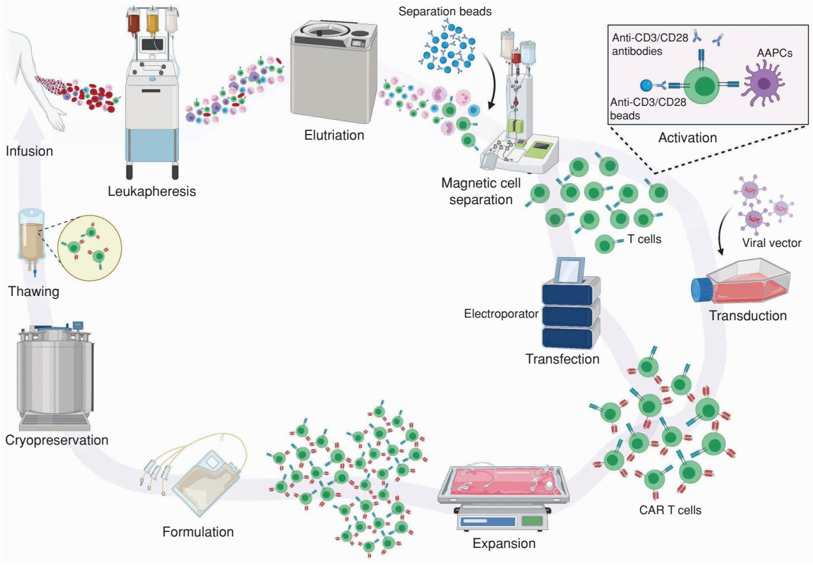
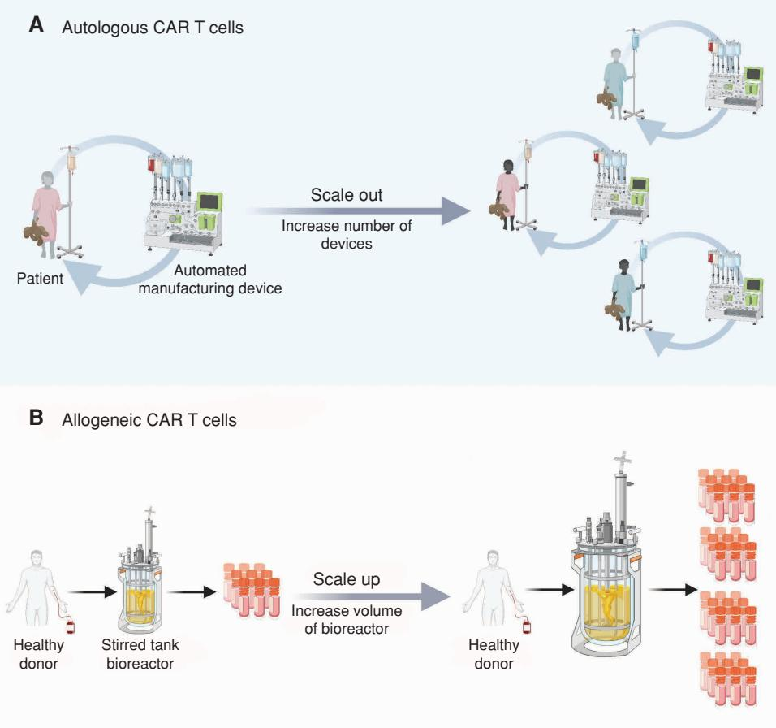
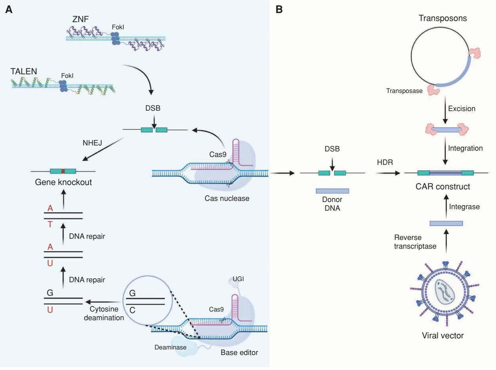
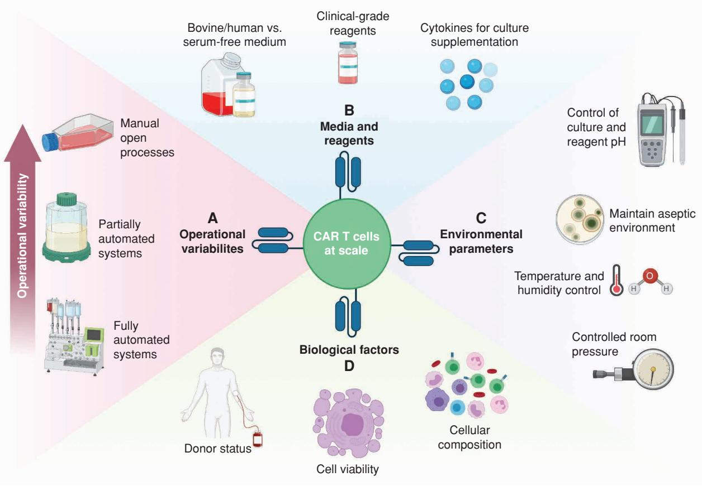

# **Review**

# **Scalable Manufacturing of CAR T Cells for Cancer Immunotherapy**

Mohamed Abou-el-Enein1,2, Magdi Elsallab2, Steven A. Feldman3, Andrew D. Fesnak4,5, Helen E. Heslop6, Peter Marks7, Brian G. Till8, Gerhard Bauer9, and Barbara Savoldo10

> **abstract** As of April 2021, there are five commercially available chimeric antigen receptor (CAR) T cell therapies for hematologic malignancies. With the current transition of CAR T cell manufacturing from academia to industry, there is a shift toward Good Manufacturing Practice (GMP)–compliant closed and automated systems to ensure reproducibility and to meet the increased demand for patients with cancer. In this review, we describe current CAR T cell clinical manufacturing models and discuss emerging technologic advances that embrace scaling and production optimization. We summarize measures being used to shorten CAR T cell manufacturing times and highlight regulatory challenges to scaling production for clinical use.

> **Significance:** As the demand for CAR T cell cancer therapy increases, several closed and automated production platforms are being deployed, and others are in development. This review provides a critical appraisal of these technologies, which can be leveraged to scale and optimize the production of nextgeneration CAR T cells.

## **INTRODUCTION**

Chimeric antigen receptor (CAR)–modified T cells have emerged as an efficacious treatment for patients with certain hematologic malignancies (1). Currently, five CAR T cell

**Note:** Supplementary data for this article are available at Blood Cancer Discovery Online (https://bloodcancerdiscov.aacrjournals.org/).

M. Abou-el-Enein, M. Elsallab, G. Bauer, and B. Savoldo contributed equally to this article.

**Corresponding Author:** Mohamed Abou-el-Enein, Keck School of Medicine, University of Southern California, 1450 Biggy Street, Health Sciences Campus, Los Angeles, CA 90033. Phone: 323-865-0501; E-mail: [abouelenein@](mailto://abouelenein@med.usc.edu) [med.usc.edu](mailto://abouelenein@med.usc.edu)

Blood Cancer Discov 2021;2:408–22

**doi:** 10.1158/2643-3230.BCD-21-0084

©2021 American Association for Cancer Research

products are approved for commercial use and available on the U.S. market: three for B-cell leukemia and lymphoma (tisagenlecleucel, axicabtagene ciloleucel, lisocabtagene maraleucel), one for mantle cell lymphoma (brexucabtagene autoleucel), and one for multiple myeloma (idecabtagene vicleucel; refs. 2–8). These therapies involve genetically modifying patient-derived (autologous) peripheral blood T cells to express a CAR directed against antigens present on the surface of targeted tumor cells, such as the CD19 molecule, or, in the case of idecabtagene vicleucel, B-cell maturation antigen (BCMA; refs. 9–14). After antigen recognition, the intracellular signaling domains activate the immune effector and memory functions of the CAR T cells. Once activated, these T cells proliferate, infiltrate tumor sites, secrete cytokines, and release cytolytic granules to eliminate targeted cells in an antigen-dependent manner (1). All approved CAR T cell products are second-generation CARs that incorporate CD28 or CD137 (4–1BB) costimulatory signals, which are essential for eliciting a clinically relevant immune response (9–15). These CAR T cells were able to elicit complete responses (CR) in 32% to 67% of patients with lymphoma and showed better CR rates in patients with leukemia (16–19).

The increasing success of CAR T immunotherapies in relapsed/refractory hematologic malignancies sparked the interest of pharmaceutical companies, and several products targeting a variety of cancers are currently in the pipeline (20). However, many limitations to current CAR T cell manufacturing must be overcome before this modality can be fully integrated into routine clinical practice. First, most CAR T cell trials to date have used autologous peripheral blood and apheresis as the main cell sources for manufacturing

1Division of Medical Oncology, Department of Medicine, and Department of Stem Cell Biology and Regenerative Medicine, Keck School of Medicine, University of Southern California, Los Angeles, California. 2Joint USC/CHLA Cell Therapy Program, University of Southern California, and Children's Hospital Los Angeles, Los Angeles, California. 3Stanford Center for Cancer Cell Therapy, Stanford Cancer Institute, Palo Alto, California.4Center for Cellular Immunotherapies, Perelman School of Medicine, University of Pennsylvania, Philadelphia, Pennsylvania. 5Department of Pathology and Laboratory Medicine, Perelman School of Medicine, University of Pennsylvania, Philadelphia, Pennsylvania. 6Center for Cell and Gene Therapy, Baylor College of Medicine, Texas Children's Hospital and Houston Methodist Hospital, Houston, Texas. 7Center for Biologics Evaluation and Research, U.S. Food and Drug Administration, Silver Spring, Maryland. 8Clinical Research Division, Fred Hutchinson Cancer Research Center, Seattle, Washington. 9Institute for Regenerative Cures (IRC), University of California Davis, Sacramento, California. 10Lineberger Comprehensive Cancer Center, University of North Carolina, Chapel Hill, North Carolina.

(9–18, 21, 22). Despite clinical success, autologous CAR T cells have sometimes suffered manufacturing delays and, in some instances, had difficulty meeting target doses in commercial production (23). Furthermore, most clinical protocols, and all the commercially approved therapies, have relied on viral vectors to deliver CAR transgenes into T cells (9–14, 24–26). Although viral vectors have proven efficient in achieving stable gene transfer, their requisite extensive safety testing adds to the cost and time to develop and manufacture CAR T cell products (27, 28). Finally, many academic institutions prefer the use of gas-permeable bioreactors, bags, or other cell culture devices to stimulate, transduce, and expand T cells to the desired clinical dose. These systems allow for high-density cells to grow without complex manipulations, easy sampling, and the ability to replenish nutrients and/or cytokines without interfering with gas exchange (29, 30). Despite their advantages in the academic setting, such platforms require trained staff and stringent cleanroom environments, making them less desirable for commercial CAR T cell manufacturing intended for a large number of patients.

By 2026, commercial CAR T cell therapies are expected to comprise the largest share of oncology drug sales in pediatric and young adult patients with acute lymphocytic leukemia (ALL; 44%) and adults with diffuse large B-cell lymphoma (46%; ref. 20). As these therapies reach commercial viability, there has also been a shift in both academia and industry to develop fully closed and automated manufacturing platforms with the potential for scaling. While such systems lessen the need for extensive manual handling of the manufactured product, they are expensive to purchase, use costly reagents and disposable culture sets, and may have sole-source providers, which can pose a risk to the supply chain. In addition, each instrument can manufacture only one product at a time; thus, scaling production requires operating parallel instruments.

As demand for CAR T cell therapies increases, particularly when therapies for solid tumors reach commercial stages, developing manufacturing platforms that enable scaling while embracing the principles of "quality by design," will be crucial. These platforms may help developers achieve robust and reproducible CAR T cell production based on sound manufacturing science and quality risk management. Here, we review current autologous CAR T cell manufacturing processes and associated challenges and suggest ways to overcome these limitations as we move toward scalable CAR T cell production. We also critically appraise current technological shifts and methods that aim to optimize the different steps involved in a CAR T cell manufacturing process.

# **A DECADE OF ADVANCES IN CAR T CELL MANUFACTURING**

## **Sources to Obtain Starting Material for Autologous CAR T Cell Therapy**

To date, autologous cells from whole blood or leukapheresis remain the most common starting material for CAR T cell products (Fig. 1). Density gradient centrifugation (DGC) is utilized with whole blood to remove red blood cells and granulocytes and to enrich for mononuclear cells. DGC, although effective, is laborious; may require open processing; and may fail to isolate lymphocytes from cell fractions with similar densities, such as monocytes. Apheresis collects the mononuclear cell layer from anticoagulated whole blood, which is rich in mature lymphocytes. For apheresis, patients are connected to a device that moves peripheral blood through a single-use disposable tubing set. Centrifugal force, guided by optical sensors, separates the blood into appropriate density bands for isolation and collection of the desired cell layer. Uncollected blood components are then returned to the patient. Peripheral blood collection is generally easier to schedule and is much less expensive than apheresis. However, apheresis is currently the most widely used method in commercial CAR T cell production protocols, as equipment is widely available (31) and a large cellular yield is usually achieved (32–34). Apheresis is preferable particularly when lymphocyte counts are low, as in patients with relapsed or refractory hematologic malignancies, or when there is a high tumor burden and paucity of T cells, as in many patients with lymphoid malignancies (32, 33).

## **Quality and Quantity of Starting Materials**

Collected T cells must retain the ability to respond to stimulation signals, successfully undergo transduction (vector entry, reverse transcription, and integration), and ultimately function when reinfused. However, the composition of autologous starting material from patients with cancer is highly variable, influenced by patient age and defects due to underlying disease or pretreatment with lymphotoxic agents (35–38). For instance, memory T-cell concentrations in patients with ALL and non-Hodgkin lymphoma decrease with each course of standard-of-care treatment (35). This depletion could result in failure of manufacture or functionality of CAR T cells (35). Predicting whether a patient will have a suboptimal T-cell yield or immunophenotype prior to collection remains challenging.

Cryopreservation of the apheresis product after collection can also influence cell quantity and quality. For instance, Panch and colleagues showed that recovery and viability of peripheral blood mononuclear cells (PBMC) was significantly reduced after freezing and thawing compared with fresh apheresis products (39). Nevertheless, the recovery of mononuclear cells after thawing was sufficient for consistent manufacturing of CAR T cells, without evidence of significant differences in expansion, transduction efficiency, or overall subset composition (39). Freezing may also preferentially deplete cell types that suppress *ex vivo* T-cell growth, such as neutrophils (40) and myeloidderived suppressor cells (MDSC; refs. 41, 42). In contrast, fresh products have logistical limitations, including a short window in which cell viability is adequate for CAR T cell manufacturing, the need to schedule collections that take into account patient health, and the availability of apheresis and manufacturing slots.

The presence of certain cellular subsets at culture initiation can negatively impact T-cell activation and expansion. The presence of MDSCs and monocytes can hamper the *ex vivo* activation and expansion of T cells (40, 42–44). Other cellular contaminants such as granulocytes and red blood cells suppress T-cell proliferation (45, 46). Contaminating regulatory T cells can also interfere with the efficacy of the final product after infusion (47). Furthermore, transduction of cells other than T lymphocytes (e.g., malignant blasts) has been observed,

**Figure 1.** The manufacturing process of clinical scale autologous CAR T cell therapies. The process starts with the isolation of PBMCs, collected either from whole blood phlebotomy or, more commonly, through a leukapheresis procedure in hospital apheresis units accredited by organizations such as the Foundation for the Accreditation of Cellular Therapy (FACT) and the Joint Accreditation Committee of ISCT-EBMT (JACIE). The PBMCs can be either cryopreserved locally and then shipped to centralized manufacturing facilities or transferred as fresh products to these centers. Often, density gradient centrifugation or elutriation is performed to reduce unwanted contaminating cells such as granulocytes, red blood cells, and platelets. The selection or depletion of specific T-cell types within the PBMCs is then performed. In some protocols, the cells are enriched for CD3+ T cells prior to or concurrent with their activation, at which point the cells are genetically modified using viral vectors or other nonviral gene delivery methods to express the CAR. The cells are then expanded in the presence of cytokines to a dose suitable for patient administration. In most protocols, the expanded cells are then formulated in an appropriate cryopreservation medium containing dimethyl sulfoxide (DMSO) and cryopreserved. After passing quality control and quality assurance lot release requirements, the gene-modified cells are shipped cryopreserved using a validated liquid nitrogen shipper to treatment locations, where the product is thawed under controlled conditions and infused into patients. AAPCs, artifical antigen-presenting cells. Created with BioRender. com.

creating the risk of engineering CARs into cancer cells, giving rise to CAR-resistant tumor cells (48). Indeed, resistance to CAR therapy was induced by the accidental transduction of a single leukemic B cell during production, causing the CAR gene to bind to the CD19 epitope on the leukemic cells, masking it from being targeted by the CAR T cells (48). As such, the starting material ideally should be purified for robust manufacturing, which may be accomplished using lymphocyte or T-cell enrichment steps. Elutriation of the leukapheresis product (Supplementary Table S1) can enrich for larger numbers of lymphocytes and reduce the number of unwanted cells.

## **Obtaining Pure and Viable T Cells for Genetic Modification**

Another target cell purification method involves enriching for T cells or specific T-cell subsets using antibodyconjugated magnetic beads for positive or negative selection, which may improve product purity and yield and, potentially, clinical responses (Fig. 1). A few centers have focused on enriching T cells based on the expression of CD62L, CD4, and CD8, as these subsets may improve persistence or antitumor activity (49–51). In addition, a larger number of CD27+CD45RO−CD8+ T cells in the starting material correlated with sustained remission in some patients with cancer (52). Defining a distinct ratio of CD4+ and CD8+ T cells in the final product may also prevent toxicities, such as cytokine release syndrome (CRS) and neurotoxicity (53–55). Similarly, the positive selection of CD8+ central memory T cells prior to manufacturing has been shown to reduce the occurrence of CRS following CAR T cell infusion (56). Nevertheless, enrichment reagents not only should be Good Manufacturing Practice (GMP) grade, but also should not elicit undesirable effects, such as premature cell activation, leading to rapid exhaustion or tonic signaling (57–59). Label-free T-cell

|                                    | Baylor College of Medicine (15, 22, 62)         | Memorial Sloan Kettering Cancer Center (10, 65)      | University of Pennsylvania (9, 11)                                                                | Fred Hutchinson Cancer Research Center (51, 53, 55)                       | National Institutes of Health (NIH; refs. (12, 13, 61) |
|------------------------------------|----------------------------------------------------|------------------------------------------------------------|------------------------------------------------------------------------------------------------------|------------------------------------------------------------------------------------|--------------------------------------------------------------|
| Source of the starting material | PBMC isolation by den sity gradient             | Apheresis product, cell wash by Cytomate cell washer | Apheresis product enriched by mononu clear cell elutriation, density gradient separation | Apheresis product followed by CD4, CD8, or CD62L selection (CliniMACS) | Apheresis product                                            |
| Fresh vs. frozen                   | Either                                             | Frozen                                                     | Either                                                                                               | Either                                                                             | Fresh                                                        |
| Culture vessels                    | Flasks, plates, G-Rex                              | Bags/rocking platform -WAVE bioreactor system        | Rocking platform -WAVE bioreactor system                                                       | Culture bags                                                                       | Culture bags                                                 |
| Activation                         | Soluble OKT3, plate/ flask-bound anti CD3/28 | CD3/CD28 antibody– coated paramag netic beads        | CD3/CD28 antibody– coated paramagnetic beads                                                   | CD3/CD28 antibodies conjugated to paramagnetic beads                   | Soluble OKT3, anti-CD3/CD28 paramagnetic beads      |
| Expansion media                    | Clicks Medium/ RPMI1640                         | X-Vivo 15                                                  | X-Vivo 15                                                                                            | RPMI1640                                                                           | AIMV medium                                                  |
| Sera                               | FBS                                                | Human serum                                                | Human serum                                                                                          | Human serum                                                                        | Human serum                                                  |
| Transduction enhancer           | RetroNectin                                        | RetroNectin                                                | RetroNectin                                                                                          | Polybrene                                                                          | RetroNectin                                                  |
| Spinoculation                      | No                                                 | No                                                         | No                                                                                                   | Yes                                                                                | No                                                           |
| Cytokines                          | IL2, IL7/15                                        | IL2                                                        | IL2                                                                                                  | IL2 and feeders                                                                    | IL2                                                          |

#### **Table 1. Academic manufacturing protocols for CAR T cell therapy**

Note: When CAR T cells were first explored in clinical trials, primarily single-center studies were conducted in academic settings, with manufacturing relying on open or semiclosed culture systems.

enrichment, a process that uses T-cell biophysical properties to isolate the cells without prematurely activating them, is one possible solution to this challenge (50).

Whether a selection process is employed or not, a T-cell activation step is required for adequate transduction and expansion (Fig. 1). To achieve this goal, T cells are activated via polyclonal stimulation using soluble anti-CD3 antibodies or immobilized CD3 and CD28 antibodies (22, 60–63). Immobilized anti-CD3 antibodies provide better cross-linking and activation of T cells, while CD28 antibodies activate costimulatory pathways in the target cells. For a long time, CD3 and CD28 antibodies have been immobilized by coating tissue culture flasks, leading to efficient T-cell stimulation; this method, however, provides a relatively small surface area for T-cell adherence, limiting culture size. Paramagnetic beads, such as Dynabeads, can also be coated with these antibodies; in suspension, the coated beads provide appropriate stimulation for much larger T-cell cultures (10, 14, 64–66). Prior to formulating the final cellular products, the beads need to be removed, as they could pose a hazard if infused into the patient. Removal is achieved by disrupting the T-cell/bead aggregates via agitation and then passing the suspension through a strong magnetic field, which retains the beads but allows cells to flow through. Recently, stimulation reagents such as Transact have been employed, which utilizes humanized anti-CD3 and anti-CD28 antibodies conjugated to a colloidal polymeric nanomatrix. The nanomatrix can be washed out in a centrifugation step, prior to final product formulation. Another similar method of T-cell stimulation is using a hydrogel "stimulation matrix" incorporating antibodies (67), which can also be removed by washing after stimulation and expansion. Other approaches, such as soluble activation proteins, lipid microbubbles, dissolvable microspheres, and linked antibodies are being explored as potential options (67–70).

After activation, T cells are genetically engineered to express CAR molecules targeting specific surface antigens (Fig. 1; Table 1). Following transduction, the cells undergo expansion to achieve the necessary clinical dose and, in most cases, are cryopreserved before infusion into patients.

# **THE EVOLUTION OF CAR T CELL MANUFACTURING PLATFORMS**

Besides the challenges of obtaining pure and viable starting material, significant batch-to-batch variability exists with autologous cells. Most current manufacturing protocols rely on open, manual processing steps susceptible to operator-introduced errors and contamination, and not easily amenable to scale-out. Moving toward functionally closed and fully automated manufacturing platforms may enable production scalability and reduce potential human error (71). In addition, developing allogeneic CAR T cell products may offer an "off-the-shelf" option once certain barriers are overcome.

## **Shifting from Open to Functionally Closed Systems**

Open systems for T-cell cultures are easily adaptable to CAR T cell expansion. Familiarity and ease of use of T flasks, gas-permeable culture bags, and membrane bioreactors have made such systems an appealing choice for smallto medium-scale manufacturing processes. For example, in the G-Rex bioreactor, T cells are cultured on a gas-permeable membrane located on the bottom of the culture "bottle" (29, 72). This bioreactor can be placed in a regular lab incubator; for media changes and cell harvests, the bioreactor is opened in a biosafety cabinet, to manually pipette fluids and cells in and out under aseptic conditions. Recently, a functionally closed version of this system was developed, allowing for a peristaltic pump to move fluids and cells in and out of the bioreactor (73, 74). A single unit of this bioreactor can provide a 500 cm2 gas-permeable surface area with 5 L media capacity, which is sufficient to expand large numbers of CAR T cells for clinical applications. The Xuri cell expansion system is another adaptable and functionally closed process for CAR T cell manufacturing based on the WAVE bioreactor platform, which also employs a separate cell washing unit (Supplementary Table S1; ref. 75). However, both the G-Rex and the Xuri systems require skilled operators at all stages.

The Quantum hollow fiber bioreactor platform has been used as a functionally closed system for cell expansion (76). Initially designed for adherent cell culture, this bioreactor has a total surface area of 2.1 m2 per disposable cartridge and has been adapted for the expansion of cells in a suspension culture. Further studies are necessary to investigate the Quantum system for genetically modified CAR T cell expansion. Efforts also have been made to automate these culture systems to improve their scalability (Supplementary Table S1). However, automation comes at the cost of flexibility, as minor adjustments in the process often require major changes in both hardware and software.

## **Replacing Manual Processing with Automation**

To achieve commercial-scale production of CAR T cell therapies, end-to end automation is desirable. There are currently two approaches to automation: fully automated closed systems or partially automated systems. Fully automated closed processes eliminate any handling of the product during manufacturing but are restricted to a single product in each production run (77–79). Fully automated systems such as the CliniMACS Prodigy (Miltenyi Biotec) and the Cocoon (Lonza) are capable of isolating T cells (either CD3+ or CD4/ CD8 enriched) from an apheresis product and moving them into a functionally closed culture and transduction process (80–82). One major advantage of these systems is the ability to use them in less stringent cleanroom classifications. However, the fill-finish step of the final product is still performed in an ISO7 cleanroom environment and depends on a skilled operator. The price of such all-in-one manufacturing systems and associated reagents may limit scaling out, as many devices are required for manufacturing products in parallel. In addition, operators must gain sufficient troubleshooting skills to circumvent any interruptions during production.

Partially automated manufacturing approaches employ modular, separated processing devices for individual manufacturing steps. Using automated manufacturing stations may enhance capacity and throughput without introducing significant product handling. Although each device can be accessed individually, very precise planning for the execution of each component of the manufacturing chain is required, and the failure of just one device may significantly impact the production workflow. To reduce human error and variability, robotic devices could be employed (83). A robotic arm system that operates in a classified cleanroom environment and allows for the isolation, expansion, harvest, concentration, and cryopreservation of adherent and suspension cells has been used to manufacture human mesenchymal stromal cells (83, 84), which could be adapted for CAR T cells.

## **Moving from Autologous to Allogeneic Products**

To unravel some of the complexity in scaling autologous CAR T cell manufacturing, considerable attempts have been made to develop "universal," allogeneic CAR T cell products. Because cells from healthy donors have not been exposed to chemotherapies and are free of tumor cells, their quality is expected to be superior to those obtained from patients with cancer. The same techniques as in autologous CAR T cell manufacturing are required for allogeneic T-cell selection, activation, and genetic engineering. However, the resulting CAR T cell product can potentially be scaled up in the expansion step to achieve large cell numbers, allowing many patients to be dosed from a single-cell collection (Fig. 2).

Because allogeneic cell expansion is intended to produce enough cells for multiple final products, it may benefit from larger scale expansion platforms. Large, stirred tank bioreactors may be used to scale up allogeneic cell products, although pitfalls such as shear forces, impeller impact, uneven gas exchange, varying hydrostatic pressures, and the overall nonphysiologic environment may impact final product quality (85). One high-throughput platform addresses the issue of scaling the process to large, stirred tank bioreactors by allowing scaled-down development runs in 100- to 250-mL single-use, disposable bioreactors that can be operated and monitored in parallel under various culture conditions. Such a platform might help determine ideal culture conditions for large-scale bioreactors and enable seamless scaling of production (Supplementary Table S1). The platform can currently expand primary T cells to a density of 5 × 106 cells per mL (86).

Despite these advantages, allogeneic CAR T cells face formidable challenges. Foremost among these is controlling the risk of allo-rejection of infused cells by the recipient immune system and, to a lesser extent, the development of graft-versus-host disease (87). To overcome these issues, gene-editing methods such as CRISPR-Cas9, transcription activator-like effector nucleases (TALEN), or zinc finger nucleases (ZFN) have been used to disrupt the expression of endogenous T-cell receptors and/or MHC on the allogeneic

**Figure 2.** Autologous scaling out versus allogeneic scaling up. **A,** In autologous settings, the concept of "scaling out" can be employed, which entails setting up multiple parallel production lines for individual patient products, running simultaneously in the same manufacturing facility. Such a scaled-out manufacturing approach can also be transferred to other manufacturing facilities to increase output. For instance, this model is currently being adopted by CAR T cell biotech companies through setting up regional manufacturing facilities in the United States and Europe as well as the expansion to other regions. **B,** Conversely, "scaling up" production, which means increasing the total cell yield per product during manufacturing, would be a more suitable approach for allogeneic products. In this scenario, cells from healthy donors undergo abundant expansion and are stored as fully tested doses where multiple patients can be treated with "off-the-shelf" products. Created with BioRender.com.

T cells (refs. 88, 89; Fig. 3). While these promising approaches mitigate immunogenic recognition of MHC-deficient CAR T cells by host CD8 T cells, the infused cells become more prone to natural killer–cell killing (87). In addition, the tolerable number of potentially alloreactive CAR T cells infused into the recipient has yet to be established (87). Several allogeneic CAR T cell products have been tested in clinical trials (90–92), with the most recent inducing remission in patients with relapsed and/or refractory B-ALL. As expected, however, allogeneic CAR T cell persistence remains shorter as compared with autologous approaches.

Unlike expansion of an immortalized cell line, scaling up allogeneic CAR T cell products, which are derived from primary cells, requires multiple donors to meet demand and may thus be subject to donor-to-donor variability. Nevertheless, in contrast to patients with cancer, the ability to source material from a large number of healthy donors enables their selection based on T-cell quality and frequency. Allogeneic T cells, just as autologous cells, must be expanded without compromising *in vivo* function. T-cell exhaustion and culture-associated metabolic changes restrict the number of population doublings, overall culture times, and quantities. Overcultured cells lose *in vivo* efficacy and show hallmarks of the "exhausted" phenotype. Potential scale-up methods are listed in Supplementary Table S1. These systems are standard in biologics manufacturing, although CAR T cell applications remain novel.

# **GENETIC MODIFICATION STRATEGIES FOR CAR T CELLS**

## **Using Viral Vectors for Genetic Modification**

Most CAR T cells for clinical trials and all commercial CAR T cells use viral vectors for genetic modification (refs. 4–8; Fig. 3). Lentiviral and gamma-retroviral vectors are the most commonly used, since both permanently integrate the transferred gene and allow for long-term gene expression. Lentiviral vectors are considered safer than gamma-retroviral vectors in terms of their semirandom integration patterns, as gene integration does not preferentially occur in start regions of active genes (93–95). Although the quality and titer of the vector are the major factors determining CAR expression, reagents (poly-l-lysine, protamine sulfate, retroncetin, vectofusin) have been routinely used to facilitate transduction or to colocalize viral particles and cells (60, 96). These reagents are either added to the culture during transduction or applied to coat plates, flasks, or bags. As an alternative or in addition, spinoculation can increase viral transduction efficiency (ref. 55; Table 1), with the caveat that this spinning process may add stress to the T cells.

Split packaging systems are used to generate both vector types, where the transgene encoding the CAR is separate from the plasmids carrying viral genes essential for viral particle formation, reverse transcription, and integration of the gene of interest in the target cell. This system greatly reduces the theoretical risk of generating replication-competent lentivirus (RCL) or retrovirus (RCR) through recombination events in the packaging cell line (97). The standard vector manufacturing protocols for both vectors employ transient transfection of several plasmid DNAs into HEK 293T producer cells. The development of stable producer cell lines for lentivectors pseudotyped with VSV-G is challenging, owing to the cytotoxicity associated with this envelope, which is not the case with other vector envelopes. While several lentiviral packaging cell lines have been described, none is commercially available—an unmet need in the vector production space (98–101).

## **Adopting Nonviral Gene Delivery Systems**

Well-designed vectors are required for clinical-grade CAR T cell manufacturing, and therefore, manufacturing vectors at scale for a reasonable price is a priority. Currently, adapting HEK 293T to suspension culture conditions and plasmid transfections using the stable cationic polymer polyethyleneimine (PEI) is the method of choice to achieve satisfactory numbers of vector-producing cells and intact, packaged vector particles secreted into the supernatant. Floating HEK 293T cells, in theory, can support large-scale manufacturing in suitable bioreactors. However, producer cells can be used only once, and each new transfection requires a new batch of producer cells. To circumvent these challenges, nonviral vectors and DNA transfections, such as the use of Sleeping Beauty or piggyBac transposons to genetically modify patient cells, have been investigated in clinical trials (refs. 102–105; Fig. 3). Disadvantages of these systems include process complexity, need for significant method optimization to overcome low efficiency of CAR expression, need for cell sorting postengineering (Supplementary Table S1), and significant cell loss during gene delivery (106). Furthermore, in a recent phase I trial, lymphoma arising from piggyBactransfected CAR T cells has been reported in two of nine patients with relapsed or refractory B-cell malignancies who achieved complete remission after product infusion. The analysis of the lymphoma samples showed an increase in the transgene copy numbers but with no integration in typical oncogenes (107, 108). These findings reiterate the need for better controlled and precise gene transfer modalities. Using CRISPR-Cas system to deliver the CAR constructs through homology-directed repair (HDR) might be an alternative option (Fig. 3), which also requires existing challenges to be adequately addressed.

Some investigators are genetically reprogramming T cells *in vivo* to eliminate the need for *ex vivo* cell manufacturing altogether. Gene-carrier nanoparticles can be engineered to transfect T cells and lead to high-efficiency CAR expression and relatively low target cell toxicity (109, 110). Preclinical studies have shown that CD8+ CAR T cells were successfully generated in mice through the injection of nanoparticles or lentiviral vectors encoding a CAR and targeting CD8+ cells (111–113). Selective *in vivo* transduction of CD4+ cells with CARs was also achieved using a lentiviral vector (113). However, systemic administration of these systems has the potential to cause genomic toxicity, warranting further investigation.

#### **Addressing Challenges to Genome Editing**

Despite the promising applications for genome editing in cancer immunotherapy, there are multiple challenges with respect to the technology itself and its clinical application, such as the efficacy of targeted delivery in the cell type of interest, establishing cell-based assays to provide functional confirmation of gene editing, or investigating and mitigating safety concerns such as immunogenicity, tumorigenicity, and off-target effects (114). Especially for CRISPR-Cas technology, there is extensive evidence on potential off-target effects when introducing mutations in undesired genomic loci (115) and induction of host immune responses upon administration (116). Off-target effects with CRISPR-Cas are initiated when the Cas/sgRNA complex binds at sites distal from the protospacer adjacent motif (PAM) target DNA-binding site and bear the risk of disrupting essential gene functions, inducing genome instability or epigenetic mutations.

When manufacturing genetically modified cell-based products, a general problem is the relatively low efficiency of stable gene transfer. For example, when applying the CRISPR-Cas9 platform to introduce the CAR transgene in T cells, this approach is still limited by technologic constraints mainly related to low efficiencies for knock-in of large gene segments (117). Moreover, besides the need for biodistribution studies and integration-site analysis, regulatory expectations also include establishing reliable off-target screening strategies with a robust validation of predetermined target sites to evaluate the extent of nucleaseinduced off-target mutagenesis. Different approaches should be implemented for unbiased genome-wide screening, *in silico* analyses, and "worst-case scenario" assays (e.g., by applying a very high nuclease concentration) characterized by a high assay sensitivity.

Genome editing may offer opportunities to improve CAR T cell manufacturing, as it reduces supply chain constraints (e.g., availability of raw materials and decrease process complexity) and financial constraints associated with the use of viral vectors if CRISPR-mediated nonviral site-specific gene integration is used. Applying CRISPR-Cas with nonviral delivery of template DNA to eliminate large genes (118) or for orthotopic placement of transgenic constructs (119) could also reduce the potential of off-target effects. The emergence of new tools such as the fusion between reverse transcriptase and catalytically impaired Cas9 endonuclease might enable the delivery of gene cassettes without the need for double-strand breaks (DSB), which also induces much lower off-target editing (120).

**Figure 3.** Advances in genetic modification of CAR T cells. Several gene editing tools can be used for gene delivery or gene modifications of CAR T cells. **A,** Knocking out genes that can interfere with the efficacy of CAR T cells is a strategy being implemented in autologous and allogeneic product manufacturing. TALENs have been used to generate universal allogeneic CAR T cells and have been tested in clinical trials (92, 148). The CRISPR-Cas9 system has also been utilized in allogeneic CAR T cell manufacturing in a similar fashion (88). Using this system, genes such as Programmed cell death protein 1 (PD-1), T-cell receptor (TCR), and beta-2 microglobulin (B2M) were knocked out, generating less alloreactive and more exhaustion-resistant T cells. Finally, the introduction of the catalytically impaired Cas9 gene editing tools enabled gene disruption without the need for double-strand breaks (DSB). The system consists of a Cas9 nickase fused to a cytidine deaminase and an uracil DNA glycosylase inhibitor (UGI). The system enables highprecision gene modifications by converting C:G to T:A base pairs. Using this technology, allogeneic CAR T cells were successfully edited to eliminate TCR, PD-1, and B2M (149). FokI, restriction endonuclease found in Flavobacterium okeanokoites; NHEJ, nonhomologous end joining. **B,** Alternatively, CRISPR-Cas9 can deliver the CAR gene cassette by means of homology-directed repair (HDR). The Cas9 system introduces DSBs in the presence of a donor DNA template that contains complementary homology arms capable of integrating at the site of the DSB. Using this approach, site-specific CAR integration can be achieved. This strategy enables the disruption of the TCR by targeting the T-cell receptor alpha chain constant (TRAC) locus while simultaneously integrating the CAR construct into the genome (150). These new modalities add more options to the commonly used viral vectors as well as nonviral approaches such as the piggyBac and Sleeping Beauty systems. Created with BioRender.com.

However, the current iterations of such tools can only deliver short genetic sequences.

# **EFFORTS TO SHORTEN CAR T CELL MANUFACTURING TIME**

Shortening CAR T cell manufacturing time will enable patients with aggressive disease to receive treatment sooner. Product manufacturing time can be divided into the cell processing and expansion stage and the batch release (quality control, or QC) stage. Recent efforts have focused on reducing the duration of the CAR T cell expansion step, which, in turn, reduces vein-to-vein manufacturing time. Murine studies revealed that CAR T cells cultured for only 3 days exhibited superior antitumor activity at a much lower dose (6-fold lower) compared with CAR T cells harvested after a longer culture period (121). In another study, rhesus macaque CAR T cells underwent a 4-day expansion in a G-Rex system after a single rapid transduction step, shortening manufacturing to 9 days (122). Similarly, Knochelmann and colleagues showed in a tumor mouse model that transduced Th17 lymphocytes, a CD4 T-cell subset that secretes cytokines such as IL6, displayed superior antitumor activity after a 4-day expansion over cells expanded for 7 or 14 days (123).

For a phase I clinical trial, researchers manufactured an autologous, bispecific CD19/CD22-targeted CAR T cell therapy using the FasT CAR platform, reducing cell culture time to less than 24 hours (124, 125). Ten adolescent and adult patients with CD19+ relapsed/refractory B-ALL received the CD19 FasT CAR T cells. On day 15 after cell infusion, 10/10 (100%) patients achieved CR, with only 1 patient experiencing CRS (125). Earlier efforts to treat refractory CD19+ tumor patients with CAR T cells generated using the *Sleeping Beauty* transposon system shorten the *ex vivo* culture of T cells to 14 days (126). Researchers at MD Anderson Cancer Center (Houston, TX) in collaboration with Ziopharm reported that six patients with active CD19+ lymphoid malignancy were infused with CAR T cells manufactured using this system. Median CAR expression upon infusion was 86% (range 19%– 97%), resulting in antitumor effects and no clinically significant CRS. Interestingly, the same team initiated a clinical trial of CD19-directed CAR T cells for patients after allogeneic stem cell transplant utilizing a "rapid personalized manufacturing process." T cells engineered using *Sleeping Beauty* were infused less than 2 days after electroporation, suggesting that the engineered T cells were infused without full characterization (NCT03579888). Efforts to achieve same-day product manufacturing have been reported for adenoviral vector Ad5f35-engineered CAR monocytes using the CAR to target tumors overexpressing HER2 (127). A phase I clinical trial to investigate this novel therapeutic approach in 18 subjects with locally advanced (unresectable) or metastatic HER2+ solid tumors has commenced (NCT04660929; ref. 128). Despite these efforts, the increased potency of rapidly generated CAR T cells will need to be balanced with their *in vivo* tolerability and long-term function.

## **TRENDS IN QC OF THE FINAL CAR T CELL PRODUCT**

While the overall length of cell culture may be reduced, the time for QC testing remains largely fixed. QC tests usually include the verification of sterility, identity, specificity, and potency for each product. Of these parameters, the sterility tests require the most time. Currently, the compendial product sterility tests take 14 days, and the fungal assay can take up to 42 days. Anaerobic- and aerobic-enriched media testing that takes 7 days is recognized by the European Pharmacopoeia as an alternative "rapid" test. In 2011, the FDA published a study that acknowledged rapid sterility tests as an alternative (129). However, the FDA does not formally recognize rapid tests. Therefore, if alternative rapid testing is performed for product release, supportive data should be submitted with validation reports. The Cell and Gene Therapy Catapult is working with industry partners to produce 1-hour sterility testing (130). Such an advancement, if accepted by regulatory agencies, would significantly accelerate product release and improve overall scalability. qPCR assays for the detection of *Mycoplasma* are now standard and reduce assay time from 28 days to 1 to 2 days (131).

Most manufacturers characterize the final CAR T cell product by flow cytometry, with many characterization panels currently in use. Several ranges/measures exist to determine the total T-cell number via CD3 expression; to characterize the CD4+ and CD8+ subsets within this population (54); to detect transduced and not transduced cells; and to identify any contaminating cell subsets, such as monocytes/macrophages (CD14; ref. 44). Qualification and validation of the assay are required prior to obtaining a Biologics License Application (BLA), which is needed in the United States for commercial manufacturing. Currently, each manufacturer specifies their own potency assay and develops, in agreement with the regulatory agencies, specific parameters appropriate for the clinical-grade product they manufacture. To date, there is no consensus on a potency assay or platform that can accurately predict clinical response to CAR T cell therapy. Ideal potency assays should be validated to ensure their reproducibility, be able to quantify tumor cell lysis mediated by CAR T cells, and provide results in real time or at least within a few days for prompt product release. An automated QC testing setup that produces real-time measurements of cell binding and killing allowing for continuous product quality monitoring during the manufacturing process may prove advantageous (132). Overall, comparing currently available potency assays in terms of treatment outcomes may aid in determining which assay best correlates with *in vivo* function of the manufactured product (133).

# **OTHER CONSIDERATIONS FOR SCALING CAR T CELL PRODUCTION**

As discussed earlier, considerable variability can hinder CAR T cell manufacturing. While variable gene expression is unavoidable in current CAR T cell generation protocols owing to retro- and lentiviral vector integration, variabilities in other manufacturing parameters can be better controlled by adopting "Quality by Design" (QBD) principles (Fig. 4). QBD principles evaluate theoretical variabilities in a process and assess risk to detect which critical parameters need to be kept under tight control.

One important consideration is the availability and constant supply of well-characterized clinical-grade reagents when transitioning from the research phase to the clinical production phase (134). These reagents add to the overall costs but are necessary to ensure the quality of the administered CAR T cell products. Production and QC staff properly trained to work under GMP conditions is another key element in product manufacture. There is consensus among academic GMP facilities as well as industry that identifying, hiring, and retaining qualified staff is challenging, creating a major barrier to successful GMP operations, particularly in the cell and gene therapy field (135). Strategies to ensure proper training and retention of GMP staff should be made a priority and should tackle issues such as competitive monetary compensations and cross-training for multiple projects and tasks. Existing initiatives for training a GMP workforce need to be expanded, harmonized, and accredited by the respective educational accreditation bodies. This need has also been recognized by the California Institute for Regenerative Medicine (CIRM), which offers educational grants to train students on cell therapy manufacturing. Such programs should optimally include theoretical and practical technical training in actual GMP facilities. Finally, a strictly controlled environment, including cleanroom suites and storage, is vital. As these therapies move beyond phase I trials, meeting these requirements becomes more costly and time-consuming (136, 137).

Achieving compliance with regulations can be another bottleneck to CAR T cell production. In the United States, the

**Figure 4.** Manufacturing variables in CAR T cell production at scale. The main sources of variability in CAR T cell manufacturing are operational variabilities (methods, personnel, equipment); raw materials and reagents (sera, media, growth factors, etc.); environmental variabilities (temperatures, particle count, gas tensions, humidity, etc.); and, most importantly, biological factors (starting material quality and composition). **A,** Operational variabilities are the result of variations in operators and/or manufacturing devices, particularly when manual open-handling systems are used. This can be kept at a minimum if fully automated manufacturing procedures are applied. **B,** Media and reagents, such as growth cytokines, that are used to achieve better cell expansion are currently not standardized and vary among different protocols. Raw materials and reagents, which themselves should be manufactured according to GMP specifications, can be difficult to obtain and may suffer from supply chain disruptions. **C,** Environmental parameters should be monitored to ensure consistency across the manufacturing process and are critical to ensure product quality and sterility. These aspects, at least in theory, are better controlled through functionally closed system manufacturing. **D,** Biological factors are difficult to control and may have to be considered as an unavoidable variable in the manufacturing process. The most important variabilities in the starting apheresis product include cell viability; T-cell content, health, and phenotype; and presence of other cellular components (37, 40, 43). While cell viability due to storage and transport can be controlled reasonably well, T-cell content, subset composition, health, and phenotype depend on patient factors including prior treatment with cytotoxic agents and, potentially, disease biology. The composition of the apheresis product from different donors also differs greatly in ancillary cells, such as macrophages and monocytes (45, 46). Depletion of ancillary cells can boost transduction efficiencies of T cells, although these additional product manipulations may reduce T-cell viability. Created with BioRender.com

FDA requires the demonstration of safety and substantial evidence of efficacy from clinical trials. Data from these trials are then used to apply for a BLA. Full implementation of GMP manufacturing rules and regulations in the United States is less cumbersome for products manufactured at academic centers for phase I trials (138). For phase II or III clinical trials, however, the FDA more tightly regulates the process. Furthermore, the manufacturing process must be validated by the end of pivotal clinical trials supporting licensure and release assays (138).

A similar clinical trial phase structure exists in the European Union, although some GMP regulations are stricter in Europe (139, 140). Full GMP compliance is required for phase I clinical trials, which could be cumbersome for academic developments (141). Also, gene-modified cellular products are subjected to greater regulatory scrutiny in the European Union than non–gene-modified therapies. A U.S. company that seeks to manufacture CAR T cells in the United States and European Union must comply with both sets of regulations and work with strict oversight from both the FDA and the European Medicines Agency (EMA) to meet respective manufacturing standards (140, 142, 143). This can lead to rather large regulatory discrepancies, particularly when raw material qualification is involved, since import and export of these materials are also strictly regulated. Therefore, developers have been keen on setting up production facilities in the respective geographic areas to fully comply with the local regulatory landscape.

Decentralized manufacturing in multiple small facilities is appealing, but new models of production scaling that rely on this approach remain a challenge to regulate (144–146). Recently, the FDA discussed decentralized manufacturing (147), which entails product manufacturing according to the same protocol at different sites and analyzing pooled safety and efficacy data. If the benefit–risk assessment is favorable, separate biologics licenses could be issued to individual sites to allow independent manufacturing at each site. This approach would facilitate the development of local product manufacturing and distribution to more patients. The FDA has noted that one of the major issues in the implementation of this model is having a sufficient understanding of the critical quality attributes of the product, so that the consistency of its manufacture can be assured from site to site. Although this may require additional time for upfront validation, reduction in costs and in lead-time delays could eventually be realized through efficiency of logistics and the overall production process.

## **CONCLUSION**

All commercialized CAR T cell products are currently based on autologous T cells; however, autologous therapies manufactured using open methods and relying on manual cell handling have a number of limitations, including variability in the starting material, difficulty in scalability to meet market demands, batch-to-batch variation, and potential human error and contamination leading to batch failures. Because the traditional scale-up model of drug manufacturing can at least be partially applied to allogeneic CAR T cell manufacturing, it may offer a theoretical scaling advantage over the autologous model. In addition, automating the manufacturing process may improve process reproducibility and robustness, and potentially lower costs when efficiently employed in large-scale production.

None of the approaches discussed here are mutually exclusive with the current model of autologous CAR T cell manufacturing. To increase the accessibility of autologous CAR T cell products, some therapies in development are transitioning toward decentralized manufacturing. Products developed in smaller academic centers equipped with GMP laboratories could be used to treat patients at regional medical centers. In such a model, automated platforms could simplify the workflow, increase process robustness, enable scalability, and reduce costs while maintaining or even improving the efficacy of the resulting CAR T cell products. Allogeneic products, however, may become the model of choice for products manufactured at scale in larger centralized commercial facilities once the limitations discussed above can be overcome.

Finally, novel approaches to shorten the manufacturing process are being developed, such as nonviral vector approaches relying on electroporation of primary cells. However, incorporating new technologies with scaling in mind should involve careful planning during early stages of development as well as careful monitoring of patients for any unexpected serious adverse reactions once the CAR T cell product is infused. In summary, the manufacturing achievements reviewed here are a step forward toward a harmonized production protocol for CAR T cell therapies. Broadly accepted levels of standardization for CAR T cell manufacturing will enable a more rapid assessment by regulatory authorities and facilitate commercialization to meet increased demand for these therapies.

## **Authors' Disclosures**

S.A. Feldman reports a patent for US201461935833P issued to KITE Pharma, a patent for US20200254018A1 pending, and a patent for EP2828290B1 issued. H.E. Heslop reports grants and personal fees from Tessa Therapeutics, grants from Kuur Therapeutics, NCI, AACR-SU2C, Leukemia & Lymphoma Society, and NIH: National Heart, Lung, and Blood Institute, and personal fees from Kiadis during the conduct of the study, as well as other support from Marker Therapeutics and Allovir outside the submitted work. B.G. Till reports other support from Mustang Bio outside the submitted work, as well as a patent for U.S. patent #10,875,927 issued and with royalties paid from Mustang Bio. B. Savoldo reports grants and other support from Tessa Theraputics and grants from bluebirdbio, NIH, Bellicum, and Cell Medica outside the submitted work. No disclosures were reported by the other authors.

#### **Acknowledgments**

The authors thank David F. Stroncek (NIH) for his helpful comments on an earlier draft of the manuscript. They thank Catherine Gillespie (Baylor College of Medicine, Houston, TX) for her assistance in editing the manuscript. H.E. Heslop is supported by the NCI (P50CA126752), the Leukemia & Lymphoma Society, and a Stand Up To Cancer Dream Team Research Grant (grant number: SU2C-AACR-DT-29–19). The indicated SU2C research grant is administered by the American Association for Cancer Research, the scientific partner of SU2C.

Received May 21, 2021; revised June 28, 2021; accepted June 30, 2021; published first August 3, 2021.

#### **References**

- 1. June CH, Sadelain M. Chimeric antigen receptor therapy. N Engl J Med 2018;379:64–73.
- 2. Elsallab M, Levine BL, Wayne AS, Abou-El-Enein M. CAR T cell product performance in haematological malignancies before and after marketing authorisation. Lancet Oncol 2020;21:e104–16.
- 3. Abramson JS, Palomba ML, Gordon LI, Lunning MA, Wang M, Arnason J, et al. Lisocabtagene maraleucel for patients with relapsed or refractory large B-cell lymphomas (TRANSCEND NHL 001): a multicentre seamless design study. Lancet 2020;396:839–52.
- 4. U.S. Food and Drug Administration. Center for Biologics Evaluation and Research. Approval letter-ABECMA. 2021. Available from: https//www.fda.gov/media/147062/download.
- 5. U.S. Food and Drug Administration. Center for Biologics Evaluation and Research. Approval letter-Breyanzi. 2021. Available from: https//www.fda.gov/media/145712/download.
- 6. U.S. Food and Drug Administration. Center for Biologics Evaluation and Research. Approval letter-Yescarta. 2017. Available from: https//www.fda.gov/media/108458/download.
- 7. U.S. Food and Drug Administration. Center for Biologics Evaluation and Research. Approval letter-Kymriah. 2017. Available from: https//www.fda.gov/media/106989/download.
- 8. U.S. Food and Drug Administration. Center for Biologics Evaluation and Research. Approval letter-Tecartus. 2020. Available from: https//www.fda.gov/media/140415/download.
- 9. Grupp SA, Kalos M, Barrett D, Aplenc R, Porter DL, Rheingold SR, et al. Chimeric antigen receptor–modified T cells for acute lymphoid leukemia. N Engl J Med 2013;368:1509–18.
- 10. Brentjens RJ, Davila ML, Riviere I, Park J, Wang X, Cowell LG, et al. CD19-targeted T cells rapidly induce molecular remissions in adults with chemotherapy-refractory acute lymphoblastic leukemia. Sci Transl Med 2013;5:177ra38.
- 11. Porter DL, Levine BL, Kalos M, Bagg A, June CH. Chimeric antigen receptor–modified T cells in chronic lymphoid leukemia. N Engl J Med 2011;365:725–33.
- 12. Kochenderfer JN, Wilson WH, Janik JE, Dudley ME, Stetler-Stevenson M, Feldman SA, et al. Eradication of B-lineage cells and regression of lymphoma in a patient treated with autologous T cells genetically engineered to recognize CD19. Blood 2010;116:4099–102.
- 13. Kochenderfer JN, Dudley ME, Kassim SH, Somerville RPT, Carpenter RO, Stetler-Stevenson M, et al. Chemotherapy-refractory diffuse large B-cell lymphoma and indolent B-cell malignancies can be effectively treated with autologous T cells expressing an anti-CD19 chimeric antigen receptor. J Clin Oncol 2015;33:540–9.
- 14. Lee DW, Kochenderfer JN, Stetler-Stevenson M, Cui YK, Delbrook C, Feldman SA, et al. T cells expressing CD19 chimeric antigen receptors for acute lymphoblastic leukaemia in children and young adults: a phase 1 dose-escalation trial. Lancet 2015;385:517–28.
- 15. Savoldo B, Ramos CA, Liu E, Mims MP, Keating MJ, Carrum G, et al. CD28 costimulation improves expansion and persistence of chimeric antigen receptor–modified T cells in lymphoma patients. J Clin Invest 2011;121:1822–6.
- 16. Neelapu SS, Locke FL, Bartlett NL, Lekakis LJ, Miklos DB, Jacobson CA, et al. Axicabtagene ciloleucel CAR T cell therapy in refractory large B-cell lymphoma. N Engl J Med 2017;377:2531–44.
- 17. Schuster SJ, Bishop MR, Tam CS, Waller EK, Borchmann P, McGuirk JP, et al. Tisagenlecleucel in adult relapsed or refractory diffuse large B-cell lymphoma. N Engl J Med 2019;380:45–56.
- 18. Wang M, Munoz J, Goy A, Locke FL, Jacobson CA, Hill BT, et al. KTE-X19 CAR T cell therapy in relapsed or refractory mantle-cell lymphoma. N Engl J Med 2020;382:1331–42.
- 19. Cohen AD, Garfall AL, Stadtmauer EA, Melenhorst JJ, Lacey SF, Lancaster E, et al. B cell maturation antigen–specific CAR T cells are clinically active in multiple myeloma. J Clin Invest 2019;129: 2210–21.
- 20. Yip A, Webster RM. The market for chimeric antigen receptor T cell therapies. Nat Rev Drug Discov 2018;17:161–2.
- 21. Till BG, Jensen MC, Wang J, Chen EY, Wood BL, Greisman HA, et al. Adoptive immunotherapy for indolent non-Hodgkin lymphoma and mantle cell lymphoma using genetically modified autologous CD20-specific T cells. Blood 2008;112:2261–71.
- 22. Pule MA, Savoldo B, Myers GD, Rossig C, Russell HV, Dotti G, et al. Virus-specific T cells engineered to coexpress tumor-specific receptors: persistence and antitumor activity in individuals with neuroblastoma. Nat Med 2008;14:1264–70.
- 23. Levine BL, Miskin J, Wonnacott K, Keir C. Global manufacturing of CAR T cell therapy. Mol Ther Methods Clin Dev 2017;4:92–101.
- 24. Casati A, Varghaei-Nahvi A, Feldman SA, Assenmacher M, Rosenberg SA, Dudley ME, et al. Clinical-scale selection and viral transduction of human naïve and central memory CD8+ T cells for adoptive cell therapy of cancer patients. Cancer Immunol Immunother 2013;62:1563–73.
- 25. Zufferey R, Nagy D, Mandel RJ, Naldini L, Trono D. Multiply attenuated lentiviral vector achieves efficient gene delivery in vivo. Nat Biotechnol 1997;15:871–5.
- 26. Brentjens RJ, Latouche J-B, Santos E, Marti F, Gong MC, Lyddane C, et al. Eradication of systemic B-cell tumors by genetically targeted human T lymphocytes co-stimulated by CD80 and interleukin-15. Nat Med 2003;9:279–86.
- 27. Wang X, Olszewska M, Qu J, Wasielewska T, Bartido S, Hermetet G, et al. Large-scale clinical-grade retroviral vector production in a fixed-bed bioreactor. J Immunother 2015;38:127–35.
- 28. van der Loo JCM, Swaney WP, Grassman E, Terwilliger A, Higashimoto T, Schambach A, et al. Scale-up and manufacturing of clinical-grade self-inactivating γ-retroviral vectors by transient transfection. Gene Ther 2012;19:246–54.
- 29. Bajgain P, Mucharla R, Wilson J, Welch D, Anurathapan U, Liang B, et al. Optimizing the production of suspension cells using the G-Rex "M" series. Mol Ther Methods Clin Dev 2014;1:14015.
- 30. Levine BL. T lymphocyte engineering ex vivo for cancer and infectious disease. Expert Opin Biol Ther 2008;8:475–89.
- 31. Karafin MS, Graminske S, Erickson P, Walters MC, Scott EP, Carter S, et al. Evaluation of the spectra optia apheresis system for mononuclear cell (MNC) collection in G-CSF mobilized and nonmobilized healthy donors: results of a multicenter study. J Clin Apher 2014;29:273–80.
- 32. Fesnak A, Lin C, Siegel DL, Maus MV. CAR-T cell therapies from the transfusion medicine perspective. Transfus Med Rev 2016;30:139–45.
- 33. Allen ES, Stroncek DF, Ren J, Eder AF, West KA, Fry TJ, et al. Autologous lymphapheresis for the production of chimeric antigen receptor T cells. Transfusion 2017;57:1133–41.
- 34. Tran CA, Burton L, Russom D, Wagner JR, Jensen MC, Forman SJ, et al. Manufacturing of large numbers of patient-specific T cells for adoptive immunotherapy. J Immunother 2007;30:644–54.
- 35. Singh N, Perazzelli J, Grupp SA, Barrett DM. Early memory phenotypes drive T cell proliferation in patients with pediatric malignancies. Sci Transl Med 2016;8:320ra3.
- 36. Fesnak AD. The challenge of variability in chimeric antigen receptor T cell manufacturing. Regen Eng Transl Med 2020;6:322–9.
- 37. Finney OC, Brakke H, Rawlings-Rhea S, Hicks R, Doolittle D, Lopez M, et al. CD19 CAR T cell product and disease attributes predict leukemia remission durability. J Clin Invest 2019;129:2123–32.
- 38. Fraietta JA, Nobles CL, Sammons MA, Lundh S, Carty SA, Reich TJ, et al. Disruption of TET2 promotes the therapeutic efficacy of CD19-targeted T cells. Nature 2018;558:307–12.
- 39. Panch SR, Srivastava SK, Elavia N, McManus A, Liu S, Jin P, et al. Effect of cryopreservation on autologous chimeric antigen receptor T cell characteristics. Mol Ther 2019;27:1275–85.
- 40. Davis MM, Fesnak A, Leskowitz RM, McKee JS, Ohayon Y, Corl CM, et al. Predictors of manufacturing (MFG) success for chimeric antigen receptor (CAR) T cells in non-Hodgkin lymphoma (NHL). Cytotherapy 2017;19:S118–9.
- 41. Gohil M, Dai A, Mackey S, Negorev D, Hennesy NA, O'Rourke M, et al. Myeloid derived suppressor cells (MDSCS) reduce the manufacturing feasibilty of gene modified T cells. Cytotherapy 2019; 21:S19.
- 42. Stroncek DF, Ren J, Lee DW, Tran M, Frodigh SE, Sabatino M, et al. Myeloid cells in peripheral blood mononuclear cell concentrates inhibit the expansion of chimeric antigen receptor T cells. Cytotherapy 2016;18:893–901.
- 43. Elavia N, Panch SR, McManus A, Bikkani T, Szymanski J, Highfill SL, et al. Effects of starting cellular material composition on chimeric antigen receptor T-cell expansion and characteristics. Transfusion 2019;59:1755–64.
- 44. Noaks E, Peticone C, Kotsopoulou E, Bracewell DG. Enriching leukapheresis improves T cell activation and transduction efficiency during CAR T processing. Mol Ther Methods Clin Dev 2021;20: 675–87.
- 45. Long K, Meier C, Bernard A, Williams D, Davenport D, Woodward J. T-cell suppression by red blood cells is dependent on intact cells and is a consequence of blood bank processing. Transfusion 2014;54:1340–7.
- 46. Munder M, Schneider H, Luckner C, Giese T, Langhans CD, Fuentes JM, et al. Suppression of T-cell functions by human granulocyte arginase. Blood 2006;108:1627–34.
- 47. Akalin I, Perna SK, De Angelis B, Okur FV, Rooney CM, Heslop H, et al. Effects of chimeric antigen receptor (CAR) expression on regulatory T cells. Mol Ther 2009;17:S25.
- 48. Ruella M, Xu J, Barrett DM, Fraietta JA, Reich TJ, Ambrose DE, et al. Induction of resistance to chimeric antigen receptor T cell therapy by transduction of a single leukemic B cell. Nat Med 2018;24: 1499–503.
- 49. Priesner C, Aleksandrova K, Esser R, Mockel-Tenbrinck N, Leise J, Drechsel K, et al. Automated enrichment, transduction, and expansion of clinical-scale CD62L + T cells for manufacturing of gene therapy medicinal products. Hum Gene Ther 2016;27:860–9.
- 50. Sommermeyer D, Hudecek M, Kosasih PL, Gogishvili T, Maloney DG, Turtle CJ, et al. Chimeric antigen receptor-modified T cells derived from defined CD8+ and CD4+ subsets confer superior antitumor reactivity in vivo. Leukemia 2016;30:492–500.
- 51. Terakura S, Yamamoto TN, Gardner RA, Turtle CJ, Jensen MC, Riddell SR. Generation of CD19-chimeric antigen receptor modified CD8+ T cells derived from virus-specific central memory T cells. Blood 2012;119:72–82.
- 52. Fraietta JA, Lacey SF, Orlando EJ, Pruteanu-Malinici I, Gohil M, Lundh S, et al. Determinants of response and resistance to CD19 chimeric antigen receptor (CAR) T cell therapy of chronic lymphocytic leukemia. Nat Med 2018;24:563–71.
- 53. Turtle CJ, Hanafi LA, Berger C, Gooley TA, Cherian S, Hudecek M, et al. CD19 CAR–T cells of defined CD4+:CD8+ composition in adult B cell ALL patients. J Clin Invest 2016;126:2123–38.
- 54. Shah NN, Highfill SL, Shalabi H, Yates B, Jin J, Wolters PL, et al. CD4/CD8 T-cell selection affects chimeric antigen receptor (CAR) T cell potency and toxicity: updated results from a phase I anti-CD22 CAR T cell trial. J Clin Oncol 2020;38:1938–50.
- 55. Gardner RA, Finney O, Annesley C, Brakke H, Summers C, Leger K, et al. Intent-to-treat leukemia remission by CD19 CAR T cells of defined formulation and dose in children and young adults. Blood 2017;129:3322–31.
- 56. Hay KA, Hanafi L-A, Li D, Gust J, Liles WC, Wurfel MM, et al. Kinetics and biomarkers of severe cytokine release syndrome after CD19 chimeric antigen receptor–modified T-cell therapy. Blood 2017;130:2295–306.
- 57. Stroncek DF, Lee DW, Ren J, Sabatino M, Highfill S, Khuu H, et al. Elutriated lymphocytes for manufacturing chimeric antigen receptor T cells. J Transl Med 2017;15:59.
- 58. Long AH, Haso WM, Shern JF, Wanhainen KM, Murgai M, Ingaramo M, et al. 4-1BB costimulation ameliorates T cell exhaustion induced by tonic signaling of chimeric antigen receptors. Nat Med 2015;21:581–90.
- 59. Weber EW, Parker KR, Sotillo E, Lynn RC, Anbunathan H, Lattin J, et al. Transient rest restores functionality in exhausted CAR-T cells through epigenetic remodeling. Science 2021;372:eaba1786.
- 60. Lamers CHJ, Willemsen RA, Luider BA, Debets R, Bolhuis RLH. Protocol for gene transduction and expansion of human T lymphocytes for clinical immunogene therapy of cancer. Cancer Gene Ther 2002;9:613–23.
- 61. Kochenderfer JN, Dudley ME, Feldman SA, Wilson WH, Spaner DE, Maric I, et al. B-cell depletion and remissions of malignancy along with cytokine-associated toxicity in a clinical trial of anti-CD19 chimeric-antigen-receptor-transduced T cells. Blood 2012;119:2709–20.
- 62. Ramos CA, Ballard B, Zhang H, Dakhova O, Gee AP, Mei Z, et al. Clinical and immunological responses after CD30-specific chimeric antigen receptor–redirected lymphocytes. J Clin Invest 2017;127:3462–71.
- 63. Ramos CA, Grover NS, Beaven AW, Lulla PD, Wu MF, Ivanova A, et al. Anti-CD30 CAR-T cell therapy in relapsed and refractory Hodgkin lymphoma. J Clin Oncol 2020;38:3794–804.
- 64. Maude SL, Frey N, Shaw PA, Aplenc R, Barrett DM, Bunin NJ, et al. Chimeric antigen receptor T cells for sustained remissions in leukemia. N Engl J Med 2014;371:1507–17.
- 65. Brentjens RJ, Rivière I, Park JH, Davila ML, Wang X, Stefanski J, et al. Safety and persistence of adoptively transferred autologous CD19-targeted T cells in patients with relapsed or chemotherapy refractory B-cell leukemias. Blood 2011;118:4817–28.
- 66. Brown CE, Alizadeh D, Starr R, Weng L, Wagner JR, Naranjo A, et al. Regression of glioblastoma after chimeric antigen receptor T-cell therapy. N Engl J Med 2016;375:2561–9.
- 67. Chin MHW, Norman MDA, Gentleman E, Coppens MO, Day RM. A hydrogel-integrated culture device to interrogate T cell activation with physicochemical cues. ACS Appl Mater Interfaces 2020;12:47355–67.
- 68. Li Y, Kurlander RJ. Comparison of anti-CD3 and anti-CD28-coated beads with soluble anti-CD3 for expanding human T cells: differing impact on CD8 T cell phenotype and responsiveness to restimulation. J Transl Med 2010;8:104.
- 69. Matus EI, Sparkes A, Gariépy J. A soluble activator that favors the ex vivo expansion of CD8+CD27+ T cells. JCI Insight 2020;5:e141293.
- 70. Lustig A, Manor T, Shi G, Li J, Wang YT, An Y, et al. Lipid microbubble– conjugated anti-CD3 and anti-CD28 antibodies (microbubble-

based human T cell activator) offer superior long-term expansion of human naive T cells in vitro. ImmunoHorizons 2020;4:475–84.

- 71. Fritsche E, Volk HD, Reinke P, Abou-El-Enein M. Toward an optimized process for clinical manufacturing of CAR-treg cell therapy. Trends Biotechnol 2020;38:1099–112.
- 72. Ludwig J, Hirschel M. Methods and process optimization for largescale CAR T expansion using the G-Rex cell culture platform. Methods Mol Biol 2020;2086:165–77.
- 73. Gagliardi C, Khalil M, Foster AE. Streamlined production of genetically modified T cells with activation, transduction and expansion in closed-system G-Rex bioreactors. Cytotherapy 2019;21:1246–57.
- 74. Vera JF, Brenner LJ, Gerdemann U, Ngo MC, Sili U, Liu H, et al. Accelerated production of antigen-specific T cells for preclinical and clinical applications using gas-permeable rapid expansion cultureware (G-Rex). J Immunother 2010;33:305–15.
- 75. Smith TA. CAR-T cell expansion in a Xuri cell expansion system W25. Methods Mol Biol 2020;2086:151–63.
- 76. Coeshott C, Vang B, Jones M, Nankervis B. Large-scale expansion and characterization of CD3+ T-cells in the Quantum® Cell Expansion System. J Transl Med 2019;17:258.
- 77. Mock U, Nickolay L, Philip B, Cheung GWK, Zhan H, Johnston ICD, et al. Automated manufacturing of chimeric antigen receptor T cells for adoptive immunotherapy using CliniMACS Prodigy. Cytotherapy 2016;18:1002–11.
- 78. Jackson Z, Roe A, Sharma AA, Lopes FBTP, Talla A, Kleinsorge-Block S, et al. Automated manufacture of autologous CD19 CAR-T cells for treatment of non-Hodgkin lymphoma. Front Immunol 2020;11:1941.
- 79. Alzubi J, Lock D, Rhiel M, Schmitz S, Wild S, Mussolino C, et al. Automated generation of gene-edited CAR T cells at clinical scale. Mol Ther Methods Clin Dev 2021;20:379–88.
- 80. Baird JH, Frank MJ, Craig J, Patel S, Spiegel JY, Sahaf B, et al. CD22-directed CAR T cell therapy induces complete remissions in CD19-directed CAR-refractory large B-cell lymphoma. Blood 2021; 137:2321–5.
- 81. Shah NN, Johnson BD, Schneider D, Zhu F, Szabo A, Keever-Taylor CA, et al. Bispecific anti-CD20, anti-CD19 CAR T cells for relapsed B cell malignancies: a phase 1 dose escalation and expansion trial. Nat Med 2020;26:1569–75.
- 82. Fernández L, Fernández A, Mirones I, Escudero A, Cardoso L, Vela M, et al. GMP-compliant manufacturing of NKG2D CAR memory T cells using CliniMACS prodigy. Front Immunol 2019;10:2361.
- 83. Murphy M, Barry F, Leschke C, Vaughan B, Gentili C, O'Dea J, et al. The AUTOSTEM platform for closed manufacture of bone marrow-derived mesenchymal stromal cells using a closed, scalable and automated robotic system. Cytotherapy 2017;19:S122.
- 84. Rafiq QA, Twomey K, Kulik M, Leschke C, O'Dea J, Callens S, et al. Developing an automated robotic factory for novel stem cell therapy production. Regen Med 2016;11:351–4.
- 85. Eaker S, Abraham E, Allickson J, Brieva TA, Baksh D, Heathman TRJ, et al. Bioreactors for cell therapies: current status and future advances. Cytotherapy 2017;19:9–18.
- 86. Costariol E, Rotondi M, Amini A, Hewitt CJ, Nienow AW, Heathman TRJ, et al. Establishing the scalable manufacture of primary human T-cells in an automated stirred-tank bioreactor. Biotechnol Bioeng 2019;116:2488–502.
- 87. Wagner DL, Fritsche E, Pulsipher MA, Ahmed N, Hamieh M, Hegde M, et al. Immunogenicity of CAR T cells in cancer therapy. Nat Rev Clin Oncol 2021;18:379–93.
- 88. Ren J, Liu X, Fang C, Jiang S, June CH, Zhao Y. Multiplex Cripsr/ Cas9 genome editing to generate potent universal CART and PD1 deficient cells against leukemia. Blood 2015;126:4280.
- 89. Depil S, Duchateau P, Grupp SA, Mufti G, Poirot L. 'Off-the-shelf' allogeneic CAR T cells: development and challenges. Nat Rev Drug Discov 2020;19:185–99.
- 90. Benjamin R, Graham C, Yallop D, Jozwik A, Mirci-Danicar OC, Lucchini G, et al. Genome-edited, donor-derived allogeneic anti-CD19 chimeric antigen receptor T cells in paediatric and adult B-cell acute lymphoblastic leukaemia: results of two phase 1 studies. Lancet 2020;396:1885–94.
- 91. Brudno JN, Somerville RPT, Shi V, Rose JJ, Halverson DC, Fowler DH, et al. Allogeneic T cells that express an anti-CD19 chimeric antigen receptor induce remissions of B-cell malignancies that progress after allogeneic hematopoietic stem-cell transplantation without causing graft-versus-host disease. J Clin Oncol 2016;34:1112–21.
- 92. Qasim W, Zhan H, Samarasinghe S, Adams S, Amrolia P, Stafford S, et al. Molecular remission of infant B-ALL after infusion of universal TALEN gene-edited CAR T cells. Sci Transl Med 2017;9:eaaj2013.
- 93. Hacein-Bey-Abina S, von Kalle C, Schmidt M, Le Deist F, Wulffraat N, McIntyre E, et al. A serious adverse event after successful gene therapy for X-linked severe combined immunodeficiency. N Engl J Med 2003;348:255–6.
- 94. Hacein-Bey-Abina S, Von Kalle C, Schmidt M, McCormack MP, Wulffraat N, Leboulch P, et al. LMO2-associated clonal T cell proliferation in two patients after gene therapy for SCID-X1. Science 2003;302:415–9.
- 95. Braun CJ, Boztug K, Paruzynski A, Witzel M, Schwarzer A, Rothe M, et al. Gene therapy for Wiskott-Aldrich syndrome–long-term efficacy and genotoxicity. Sci Transl Med 2014;6:227ra33.
- 96. Tumaini B, Lee DW, Lin T, Castiello L, Stroncek DF, Mackall C, et al. Simplified process for the production of anti–CD19-CAR– engineered T cells. Cytotherapy 2013;15:1406–15.
- 97. Cornetta K, Duffy L, Feldman SA, Mackall CL, Davila ML, Curran KJ, et al. Screening clinical cell products for replication competent retrovirus: the national gene vector biorepository experience. Mol Ther Methods Clin Dev 2018;10:371–8.
- 98. Sanber KS, Knight SB, Stephen SL, Bailey R, Escors D, Minshull J, et al. Construction of stable packaging cell lines for clinical lentiviral vector production. Sci Rep 2015;5:9021.
- 99. Throm RE, Ouma AA, Zhou S, Chandrasekaran A, Lockey T, Greene M, et al. Efficient construction of producer cell lines for a SIN lentiviral vector for SCID-X1 gene therapy by concatemeric array transfection. Blood 2009;113:5104–10.
- 100. Powers AD, Drury JE, Hoehamer CF, Lockey TD, Meagher MM. Lentiviral vector production from a stable packaging cell line using a packed bed bioreactor. Mol Ther Methods Clin Dev 2020;19:1–13.
- 101. Chen YH, Pallant C, Sampson CJ, Boiti A, Johnson S, Brazauskas P, et al. Rapid lentiviral vector producer cell line generation using a single DNA construct. Mol Ther Methods Clin Dev 2020;19: 47–57.
- 102. Kebriaei P, Singh H, Huls MH, Figliola MJ, Bassett R, Olivares S, et al. Phase I trials using Sleeping Beauty to generate CD19-specific CAR T cells. J Clin Invest 2016;126:3363–76.
- 103. Magnani CF, Gaipa G, Lussana F, Belotti D, Gritti G, Napolitano S, et al. Sleeping Beauty–engineered CAR T cells achieve antileukemic activity without severe toxicities. J Clin Invest 2020;130:6021–33.
- 104. Barnett BE, Hermanson DL, Smith JB, Wang X, Tan Y, Martin CE, et al. piggyBacTM-produced CAR-T cells exhibit stem-cell memory phenotype. Blood 2016;128:2167.
- 105. Bishop DC, Clancy LE, Burgess J, Mathew G, Atkins E, Advic S, et al. Matched sibling donor-derived piggybac CAR19 T cells induce remission of relapsed/refractory CD19+ malignancy following haematopoietic stem cell transplant. Cytotherapy 2019;21:S9.
- 106. Sherba JJ, Hogquist S, Lin H, Shan JW, Shreiber DI, Zahn JD. The effects of electroporation buffer composition on cell viability and electro-transfection efficiency. Sci Rep 2020;10:3053.
- 107. Bishop DC, Clancy LE, Simms R, Burgess J, Mathew G, Moezzi L, et al. Development of CAR T cell lymphoma in two of ten patients effectively treated with piggyBac modified CD19 CAR T cells. Blood 2021 May 19 [Epub ahead of print].
- 108. Micklethwaite KP, Gowrishankar K, Gloss BS, Li Z, Street JA, Moezzi L, et al. Investigation of product derived lymphoma following infusion of piggyBac modified CD19 chimeric antigen receptor T-cells. Blood 2021 May 11 [Epub ahead of print].
- 109. Chang L, Gallego-Perez D, Zhao X, Bertani P, Yang Z, Chiang CL, et al. Dielectrophoresis-assisted 3D nanoelectroporation for nonviral cell transfection in adoptive immunotherapy. Lab Chip 2015;15: 3147–53.
- 110. Smith TT, Stephan SB, Moffett HF, McKnight LE, Ji W, Reiman D, et al. In situ programming of leukaemia-specific T cells using synthetic DNA nanocarriers. Nat Nanotechnol 2017;12:813–20.
- 111. Agarwal S, Weidner T, Thalheimer FB, Buchholz CJ. In vivo generated human CAR T cells eradicate tumor cells. Oncoimmunology 2019;8:e1671761.
- 112. Pfeiffer A, Thalheimer FB, Hartmann S, Frank AM, Bender RR, Danisch S, et al. In vivo generation of human CD 19-CAR T cells results in B-cell depletion and signs of cytokine release syndrome. EMBO Mol Med 2018;10:e9158.
- 113. Agarwal S, Hanauer JDS, Frank AM, Riechert V, Thalheimer FB, Buchholz CJ. In vivo generation of CAR T cells selectively in human CD4+ lymphocytes. Mol Ther 2020;28:1783–94.
- 114. Abou-El-Enein M, Cathomen T, Ivics Z, June CH, Renner M, Schneider CK, et al. Human genome editing in the clinic: new challenges in regulatory benefit-risk assessment. Cell Stem Cell 2017;21:427–30.
- 115. Wang Y, Wang M, Zheng T, Hou Y, Zhang P, Tang T, et al. Specificity profiling of CRISPR system reveals greatly enhanced off-target gene editing. Sci Rep 2020;10:2269.
- 116. Wagner DL, Amini L, Wendering DJ, Burkhardt LM, Akyüz L, Reinke P, et al. High prevalence of Streptococcus pyogenes Cas9 reactive T cells within the adult human population. Nat Med 2019; 25:242–8.
- 117. Lino CA, Harper JC, Carney JP, Timlin JA. Delivering CRISPR: a review of the challenges and approaches. Drug Deliv 2018;25:1234–57.
- 118. Roth TL, Puig-Saus C, Yu R, Shifrut E, Carnevale J, Li PJ, et al. Reprogramming human T cell function and specificity with nonviral genome targeting. Nature 2018;559:405–9.
- 119. Schober K, Müller TR, Gökmen F, Grassmann S, Effenberger M, Poltorak M, et al. Orthotopic replacement of T-cell receptor α- and β-chains with preservation of near-physiological T-cell function. Nat Biomed Eng 2019;3:974–84.
- 120. Anzalone AV, Randolph PB, Davis JR, Sousa AA, Koblan LW, Levy JM, et al. Search-and-replace genome editing without double-strand breaks or donor DNA. Nature 2019;576:149–57.
- 121. Ghassemi S, Nunez-Cruz S, O'Connor RS, Fraietta JA, Patel PR, Scholler J, et al. Reducing ex vivo culture improves the antileukemic activity of chimeric antigen receptor (CAR) T cells. Cancer Immunol Res 2018;6:1100–9.
- 122. Pampusch MS, Haran KP, Hart GT, Rakasz EG, Rendahl AK, Berger EA, et al. Rapid transduction and expansion of transduced T cells with maintenance of central memory populations. Mol Ther Methods Clin Dev 2020;16:1–10.
- 123. Knochelmann HM, Dwyer CJ, Smith AS, Bowers JS, Wyatt MM, Nelson MH, et al. IL6 fuels durable memory for Th17 cell–mediated responses to tumors. Cancer Res 2020;80:3920–32.
- 124. Zhang C, He J, Liu L, Wang J, Wang S, Liu L, et al. CD19-directed fast CART therapy for relapsed/refractory acute lymphoblastic leukemia: from bench to bedside. Blood 2019;134:1340.
- 125. Yang J, He J, Zhang X, Wang Z, Zhang Y, Cai S, et al. A feasibility and safety study of a new CD19-directed fast CAR-T therapy for refractory and relapsed B cell acute lymphoblastic leukemia. Blood 2019;134:825.
- 126. Kebriaei P, Huls H, Neel SL, Olivares S, Orozco AF, Su S, et al. Shortening the time to manufacture CAR+ T cells with Sleeping Beauty system supports T-cell engraftment and anti-tumor effects in patients with refractory CD19+ tumors. Blood 2017; 130:2060.
- 127. Gabitova L, Menchel B, Gabbasov R, Pierini S, Best A, Ross K, et al. Anti-HER2 CAR monocytes demonstrate targeted anti-tumor activity and enable a single day cell manufacturing process [abstract]. In: Proceedings of the American Association for Cancer Research Annual Meeting 2021; 2021 Apr 10–15 and May 17–21. Philadelphia (PA): AACR; 2021. Abstract nr 1530.
- 128. Bauml J, Barton D, Ronczka A, Cushing D, Klichinsky M, Dees EC, et al. A phase 1, first in human (FIH) study of adenovirally transduced autologous macrophages engineered to contain an anti-HER2 chimeric antigen receptor (CAR) in subjects with HER2 overexpressing

solid tumors [abstract]. In: Proceedings of the 2020 San Antonio Breast Cancer Virtual Symposium; 2020 Dec 8–11; San Antonio, TX. Philadelphia (PA): AACR; 2021. Abstract nr OT-28-06.

- 129. Parveen S, Kaur S, David SAW, Kenney JL, McCormick WM, Gupta RK, et al. Evaluation of growth based rapid microbiological methods for sterility testing of vaccines and other biological products. Vaccine 2011;29:8012–23.
- 130. Lin-Gibson S, Lin NJ, Jackson S, Viswanathan S, Zylberberg C, Wolfrum J, et al. Standards efforts and landscape for rapid microbial testing methodologies in regenerative medicine. Cytotherapy 2021;23:390–8.
- 131. Sung J, Hawkins JR. A highly sensitive internally-controlled realtime PCR assay for mycoplasma detection in cell cultures. Biologicals 2020;64:58–72.
- 132. Cerignoli F, Abassi YA, Lamarche BJ, Guenther G, Santa Ana D, Guimet D, et al. In vitro immunotherapy potency assays using realtime cell analysis. PLoS One 2018;13:e0193498.
- 133. Kiesgen S, Messinger JC, Chintala NK, Tano Z, Adusumilli PS. Comparative analysis of assays to measure CAR T cell-mediated cytotoxicity. Nat Protoc 2021;16:1331–42.
- 134. Abou-El-Enein M, Duda GN, Gruskin EA, Grainger DW. Strategies for derisking translational processes for biomedical technologies. Trends Biotechnol 2017;35:100–8.
- 135. Digiusto DL, Melsop K, Srivastava R, Tran C-AT. Proceedings of the first academic symposium on developing, qualifying and operating a cell and gene therapy manufacturing facility. Cytotherapy 2018;20:1486–94.
- 136. Abou-El-Enein M, Römhild A, Kaiser D, Beier C, Bauer G, Volk HD, et al. Good Manufacturing Practices (GMP) manufacturing of advanced therapy medicinal products: a novel tailored model for optimizing performance and estimating costs. Cytotherapy 2013; 15:362–83.
- 137. Abou-El-Enein M, Bauer G, Medcalf N, Volk H-D, Reinke P. Putting a price tag on novel autologous cellular therapies. Cytotherapy 2016;18:1056–61.
- 138. U.S. Food and Drug Administration. Guidance for industry: CGMP for phase 1 investigational drugs. Rockville (MD): U.S. Food and Drug Administration; 2008. Available from: https:// www.fda.gov/media/70975/download.
- 139. Elsallab M, Bravery CA, Kurtz A, Abou-el-Enein M. Mitigating deficiencies in evidence during regulatory assessments of advanced therapies: a comparative study with other biologicals. Mol Ther Methods Clin Dev 2020;18:269–79.
- 140. European Medicines Agency (EMA). Guidelines on good manufacturing practice specific to advanced therapy medicinal products. 2017. Available from: [https://ec.europa.eu/health/sites/health/files/](https://ec.europa.eu/health/sites/health/files/files/eudralex/vol-4/2017_11_22_guidelines_gmp_for_atmps.pdf) [files/eudralex/vol-4/2017\\_11\\_22\\_guidelines\\_gmp\\_for\\_atmps.pdf.](https://ec.europa.eu/health/sites/health/files/files/eudralex/vol-4/2017_11_22_guidelines_gmp_for_atmps.pdf)
- 141. Abou-El-Enein M, Volk HD, Reinke P. Clinical development of cell therapies: setting the stage for academic success. Clin Pharmacol Ther 2017;101:35–8.
- 142. CFR Code of Federal Regulations Title 21 Food and Drugs. 2020. Available from: [https://www.accessdata.fda.gov/scripts/cdrh/](https://www.accessdata.fda.gov/scripts/cdrh/cfdocs/cfcfr/cfrsearch.cfm) [cfdocs/cfcfr/cfrsearch.cfm.](https://www.accessdata.fda.gov/scripts/cdrh/cfdocs/cfcfr/cfrsearch.cfm)
- 143. Gaspar Ernesto LM, Dias Loureiro RM. Pharmaceutical manufacturing in the EU and the EU–US mutual recognition agreement. PDA J Pharm Sci Technol 2020;74:617–26.
- 144. Abou-El-Enein M, Elsanhoury A, Reinke P. Overcoming challenges facing advanced therapies in the EU market. Cell Stem Cell 2016;19:293–7.
- 145. Wang K, Liu Y, Li J, Wang B, Bishop R, White C, et al. A multiscale simulation framework for the manufacturing facility and supply chain of autologous cell therapies. Cytotherapy 2019;21:1081–93.
- 146. Harrison RP, Ruck S, Medcalf N, Rafiq QA. Decentralized manufacturing of cell and gene therapies: overcoming challenges and identifying opportunities. Cytotherapy 2017;19:1140–51.
- 147. Marks P, Gottlieb S. Balancing safety and innovation for cell-based regenerative medicine. N Engl J Med 2018;378:954–9.
- 148. Poirot L, Philip B, Schiffer-Mannioui C, Le Clerre D, Chion-Sotinel I, Derniame S, et al. Multiplex genome-edited T-cell manufacturing platform for "Off-the-Shelf" adoptive T-cell immunotherapies. Cancer Res 2015;75:3853–64.
- 149. Webber BR, Lonetree C, Kluesner MG, Johnson MJ, Pomeroy EJ, Diers MD, et al. Highly efficient multiplex human T cell engineering without double-strand breaks using Cas9 base editors. Nat Commun 2019;10:5222.
- 150. Eyquem J, Mansilla-Soto J, Giavridis T, van der Stegen SJC, Hamieh M, Cunanan KM, et al. Targeting a CAR to the TRAC locus with CRISPR/Cas9 enhances tumour rejection. Nature 2017;543:113–7.