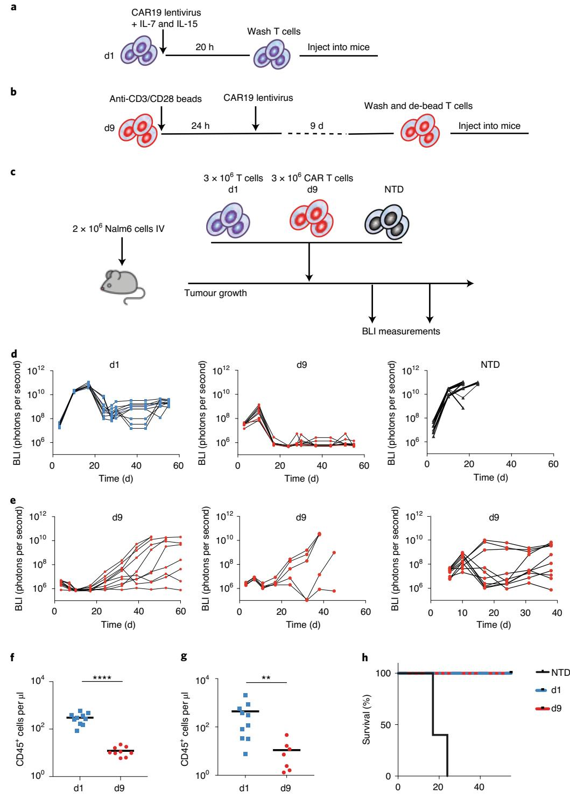

# **Rapid manufacturing of non-activated potent CAR T cells**

**Saba Ghassemi 1,2** ✉**, Joseph S. Durgin1 , Selene Nunez-Cruz1,2, Jai Patel1 , John Leferovich1,2, Marilia Pinzone2 , Feng Shen1 , Katherine D. Cummins  1 , Gabriela Plesa  1 , Vito Adrian Cantu3 , Shantan Reddy3 , Frederic D. Bushman3 , Saar I. Gill1,4, Una O'Doherty2 , Roddy S. O'Connor 1,2 and Michael C. Milone 1,2** ✉

**Chimaeric antigen receptor (CAR) T cells can generate durable clinical responses in B-cell haematologic malignancies. The manufacturing of these T cells typically involves their activation, followed by viral transduction and expansion ex vivo for at least 6 days. However, the activation and expansion of CAR T cells leads to their progressive differentiation and the associated loss of anti-leukaemic activity. Here we show that functional CAR T cells can be generated within 24 hours from T cells derived from peripheral blood without the need for T-cell activation or ex vivo expansion, and that the efficiency of viral transduction in this process is substantially influenced by the formulation of the medium and the surface area-to-volume ratio of the culture vessel. In mouse xenograft models of human leukaemias, the rapidly generated non-activated CAR T cells exhibited higher anti-leukaemic in vivo activity per cell than the corresponding activated CAR T cells produced using the standard protocol. The rapid manufacturing of CAR T cells may reduce production costs and broaden their applicability.**

Adoptive cellular immunotherapy using T cells that are genetically modified to express a chimaeric antigen receptor (CAR) or cloned T cell receptor (TCR) yield durable clinical responses in patients with cancer[1](#page-9-0)[–6](#page-9-1) . The effectiveness of adoptive cellular immunotherapy led to the regulatory approval of several CD19-specific CAR T (CART19) cell therapies, including tisagenlecleucel and axicabtagene ciloleucel. Both these therapies involve the isolation of mononuclear cells containing T cells from the peripheral blood of the patient, followed by T-cell activation through their endogenous T cell receptor–CD3 complex, genetic modification using a viral vector and expansion ex vivo before re-infusion. We recently showed that activated T cells undergoing rapid proliferation ex vivo differentiate towards effector cells with a loss of anti-leukaemic potenc[y7](#page-9-2) . The ability of T cells to engraft following adoptive transfer is related to their state of differentiation with less-differentiated naive-like and central memory cells showing the greatest potency in several preclinical studie[s8–](#page-9-3)[11.](#page-9-4) A number of interventions have been reported to limit the differentiation of T cells and enhance the potency of ex vivo-expanded T cells, such as blockade of Fas–FasL interactions[12,](#page-9-5) inhibition of Akt signalling[13](#page-9-6)[,14](#page-9-7) or activation of Wnt signalling[15–](#page-9-8)[17.](#page-9-9) However, elimination of the activation step and corresponding proliferative phase of T cells ex vivo offers a far simpler and more cost-effective approach provided the barriers to gene transfer into quiescent T cells can be overcome.

Natural human immunodeficiency virus (HIV) has the ability to infect quiescent T cells in the G0 stage of the cell cycle[18–](#page-9-10)[20.](#page-9-11) Unlike gammaretroviruses, HIV-based lentiviral vectors can infect both dividing and non-dividing cells. However, the transduction efficiencies in quiescent T cells are typically lower than their activated counterparts. Lentiviral infection is a multi-step process involving binding of the viral particle to the plasma membrane of a T cell and endocytosis, followed by envelope fusion, reverse transcription to form a pre-integrated DNA provirus and finally integration into the host T-cell genome. Lentiviral particles that are pseudotyped with the vesicular stomatitis virus g-glycoprotein (VSV-G) to broaden the viral tropism depend on the low-density lipoprotein receptor (LDL-R), which is ubiquitously expressed on the surface of various cells, including lymphocytes, for entr[y21](#page-9-12),[22.](#page-10-0) Limitations to efficient lentiviral transduction of quiescent T cells occur at each stage of infection. The fusion of lentiviral particles with quiescent T cells is inefficien[t23,](#page-10-1)[24](#page-10-2). Conditioning the cell culture medium with recombinant interleukin (IL)-7 and IL-15 cytokines can overcome this limitatio[n25](#page-10-3) and increase the transduction efficiencies as well as cell survival in quiescent T cells[26,](#page-10-4)[27](#page-10-5). Engineering viral particles to express an IL-7 fusion protein increases quiescent T-cell lentiviral transductio[n28.](#page-10-6) Post entry, low concentrations of nucleotides and the presence of additional restriction factors such as SAMHD1 limit the rate of reverse transcription in quiescent T cell[s29](#page-10-7)[–31.](#page-10-8) Collectively, these factors make lentiviral transduction of non-activated T cells inefficient.

Having previously shown that shortening the ex vivo culture of CAR T cells yields a cellular product with less-differentiated T cells and significantly enhanced effector function, we hypothesized that elimination of the CD3 and CD28 (CD3/CD28) activation step could yield a T-cell product with high functional potency. Reducing the culture duration could also substantially reduce the vein-to-vein time and substantially improve the logistics required to make CAR T-cell products. Here we have overcome some of the barriers to lentiviral transduction of non-activated T cells with a CAR by modifying the ex vivo manufacturing protocol. This technical advance resulted in CAR T cells with potent antitumor function that were available within 24h of mononuclear-cell collection compared with

1 Center for Cellular Immunotherapies, Perelman School of Medicine, University of Pennsylvania, Philadelphia, PA, USA. 2 Department of Pathology and Laboratory Medicine, Perelman School of Medicine, University of Pennsylvania, Philadelphia, PA, USA. 3 Department of Microbiology, Perelman School of Medicine, University of Pennsylvania, Philadelphia, PA, USA. 4Division of Hematology–Oncology, Department of Medicine, Perelman School of Medicine, University of Pennsylvania, Philadelphia, PA, USA. ✉e-mail: [ghassemi@pennmedicine.upenn.edu;](mailto:ghassemi@pennmedicine.upenn.edu) [milone@pennmedicine.upenn.edu](mailto:milone@pennmedicine.upenn.edu)

the 9d process currently used by tisagenlecleucel. These results demonstrate the potential for a vast reduction in the time, materials and labour required to generate CAR T cells, which could be especially beneficial in patients with rapidly progressive disease and in resource-poor healthcare environments.

### **Results**

**Transduction of non-activated T cells by lentiviral vectors.** We confirmed the previously reported low transduction efficiency of freshly isolated quiescent T cells with VSV-G-pseudotyped lentivirus vector. Primary human T cells obtained from healthy donors were mixed with an infrared red fluorescent protein (iRFP)-encoding lentiviral vector under conditions identical to activated T cells and followed for 96h to assess the efficiency and kinetics of transduction (Fig. [1a\)](#page-2-0). In comparison to lentiviral transduction of T cells activated 24h previously with anti-CD3/CD28 microbeads at a multiplicity of infection (MOI) of five, which yields >85% transduction at 48h, the efficiency (Fig. [1a](#page-2-0)) and kinetics (Fig. [1b,c\)](#page-2-0) of lentiviral transduction in non-activated T cells was substantially slower, requiring at least 72h to achieve detectable expression of an *iRFP* transgene and with a transduction efficiency that was about 11-fold lower at 96h than activated T cells (Fig. [1a\)](#page-2-0). The slower kinetics of this process is consistent with the previous observation of inefficient transduction efficiency of VSV-G-pseudotyped lentivirus vector[23](#page-10-1) and the decreased rate of reverse transcription reported for natural HIV in quiescent T cells compared with activated T cell[s32.](#page-10-9) Transduction was observed in both memory and naive subsets of CD4+ and CD8+ T cells, with the highest efficiency observed in CD8+ cells with a memory phenotype (Fig. [1d,e\)](#page-2-0).

We repeated the same studies using a third-generation lentiviral vector encoding a CD19-specific CAR (CAR19), which in contrast to the cytoplasmic nature of iRFP is a cell membrane-expressed protein. The levels of CAR expression were measured by immunostaining with a monoclonal antibody recognizing the idiotype of the single-chain variable fragment[33.](#page-10-10) In a similar kinetic analysis to that performed with the iRFP-encoding lentiviral vector, we observed that non-activated T cells acquired CAR expression as early as 12h after the addition of the CAR lentiviral vector, with a steady increase to >80% of T cells transduced by 96h (Fig. [2a](#page-3-0)). To determine whether the CARs were stably expressed, the T cells were treated with either a reverse transcriptase (RT) or integrase inhibitor during the lentiviral transduction process. As shown in Fig. [2b,c](#page-3-0), CAR expression in non-activated T cells was unaffected by either compound, whereas both RT and integrase inhibition completely abrogated CAR expression in activated T cells. This pseudotransduction observed in non-activated T cells is probably due to the transfer of CAR protein from the lentiviral vector envelope by viral fusion to the T cell, as it is well-known that membrane proteins expressed in the packaging cells are incorporated into the HIV envelop[e34.](#page-10-11) The absence of apparent pseudotransduction with a vector that encodes iRFP, a cytoplasmic protein, provides support for this envelope-mediated transfer mechanism (Fig. [2d](#page-3-0)). Notably, the observed pseudotransduction was not exclusive to non-activated T cells. However, greater rates of pinocytosis in activated T cells may increase cell-membrane turnover and hence clearance of passively transferred proteins contributing to pseudotransduction. Importantly, CART19 cells generated by lentiviral transduction of non-activated T cells in the presence of RT and integrase inhibitors showed no specific cytolytic activity and cytokine production against CD19-expressing target cells (Supplementary Fig. 1a,b). Based on these data, we conclude that long-term persistence of CAR expression in T cells will require vector integration, which occurs at a substantially lower frequency in non-activated T cells compared with activated T cells.

Although functional CAR expression could not be assessed post transduction due to the substantial pseudotransduction, we hypothesized that the transduction process would probably continue following adoptive transfer in vivo, giving rise to functional CART19 cells. We therefore performed an in vivo experiment to evaluate non-activated CART19 cells transduced for 24h (day 1, d1) as in Fig. [1](#page-2-0) using a well-established Nalm6 B-cell acute lymphoblastic leukaemia (ALL) mouse model[35](#page-10-12). As shown in Fig. [3,](#page-4-0) a dose of 3×106 non-activated CART19 cells (d1) washed and infused within 24h of collection was compared with a dose of 3×106 CAR+ CD3/CD28-activated CAR T cells that were expanded ex vivo for 9d before injection, a research process comparable to that used to manufacture tisagenlecleucel, as shown schematically in Fig. [3a,b.](#page-4-0) Although non-activated CAR T cells were unable to induce a complete regression of leukaemia, they controlled leukaemia for an extended duration of 60d. As a comparison, we show the effectiveness of d9 CAR T cells is highly variable across donors (Fig. [3d,e](#page-4-0)). Typically, d9 cells exit their logarithmic growth phase and are resting down. However, some donors can maintain high metabolic activity and function at this time point. This contributes to donor-to-donor variability in antitumour responses. Given the persistence of T cells in the peripheral blood of mice (Fig. [3f,g\)](#page-4-0), our findings suggest that non-activated CAR T cells retain replicative capacity to maintain function under continuous antigenic stimulation (Fig. [3d\)](#page-4-0). This contributed to a significant increase in the overall survival of the leukaemia-bearing mice (Fig. [3h](#page-4-0)). These results support the functional nature of non-activated CART19 cells, and they encouraged the optimization of the transduction process to further enhance non-activated CART19 activity.

**Modification of the culture conditions to enhance non-activated T-cell transduction.** Numerous mechanisms restrict quiescent T-cell infection by natural HIV. Viral attachment and entry represent a critical initial phase of the transduction process, during which the RNA genome of the lentiviral vector is inserted into the cytoplasm of the host T cell. Although natural HIV uses both chemokine receptors and CD4 for attachment and entr[y36](#page-10-13), VSV-G-pseudotyped lentiviral vectors use the LDL-R as their primary recepto[r22.](#page-10-0) The low transduction efficiency of non-activated T cells has been attributed to low expression of LDL-R[21](#page-9-12). As the abundance of LDL-R is linked to the metabolic state of the cell and LDL uptake can be enhanced by cholesterol restrictio[n37](#page-10-14), we evaluated whether a brief serum starvation before lentiviral-vector transduction increases the lentiviral-vector transduction of non-activated T cells. Brief (3–6h) serum starvation increased iRFP expression by an average of twofold in non-activated T cells (Fig. [4a](#page-5-0) and Supplementary Fig. 1). The slow kinetics of reverse transcription in non-activated T cells by both natural HIV and lentiviral vectors also contribute to the reduced transduction efficiency. Completion of reverse transcription during natural HIV infection is enhanced by high concentrations of deoxynucleosides (dNs)[19](#page-9-13). Supplementation of the culture medium with 50 µM dNs also increased the lentiviral transduction of non-activated T cells by two- to threefold (Fig. [4b](#page-5-0)). Finally, the limited diffusibility of lentivirus in large culture vessels is another major barrier limiting the transduction efficiency in T cell[s38.](#page-10-15) To evaluate this, we adjusted the geometric conditions to enhance the colocalization of vector particles with T cells. By increasing the surface area-to-volume ratio of the culture vessel, while keeping the volume constant, we increased the transduction of non-activated T cells by at least twofold (Fig. [4c](#page-5-0)). Furthermore, we show that the transduction efficiencies can be enhanced by 2–12-fold in non-activated T cells by combining these approaches (Fig. [4d](#page-5-0)).

Given that pseudotransduction with CAR19 interferes with the ability to estimate the transduction efficiency (Fig. [2](#page-3-0)) and vector integration is likely to be ongoing at the time of infusion, we estimated the efficiency of the optimized transduction process by adoptively transferring the transduced T cells into non-leukaemia-bearing NSG mice, which permits an estima-

**Fig. 1 | Lentiviral vectors transduce non-activated T-cell subsets with a preference for memory subsets. a**, Transduction efficiency of freshly isolated human T cells that were either cultured in IL-7 (10 ng ml−1 ) and IL-15 (10 ng ml−1 ) or activated with beads coated with anti-CD3/CD28 and transduced with lentiviral vector encoding iRFP for 5 d. The mean of each group is indicated by the solid black line. The two groups were compared using a two-tailed unpaired Mann–Whitney test; *P*= 0.0079. **b**,**c**, Freshly isolated human T cells were cultured in IL-7 and IL-15, and transduced with lentiviral vector encoding iRFP for the indicated time periods. **b**, iRFP+ cells were quantified by flow cytometry. Ctrl, control. **c**, Similar transduction efficiencies were obtained in an independent experiment from six different donors. Data are the mean ± s.e.m. **d**, Representative flow cytometric analysis of non-activated T cells transduced as in **a**. Naive, central memory (Tcm), effector memory (Tem) and total effector (Tte) T-cell subsets were identified following gating on live singlets of CD3+CD4+ (top) and CD3+CD8+ (bottom) T cells using CD45RO and CCR7 expression. **b**,**d**, The percentages of transduced cells (pink boxes) are indicated. **e**, Similar transduction efficiencies were obtained in an independent experiment from six different donors. CD4+ versus CD8+ cells, *P*= 0.0308; two-tailed paired *t*-test (left). CD8+ naive-like T cells versus Tcm, Tem and Tte cells, *P*= 0.0133, 0.0204 and 0.0427, respectively (right); and CD4+ naive-like T cells versus Tcm and Tem cells, *P*= 0.0423 and 0.0208, respectively (middle); paired one-way analysis of variance. \**P*< 0.05; *\*\*P*< 0.01.

tion of the frequency of integrated vector in the absence of CAR stimulation by antigen-expressing tumour cells that would normally stimulate and enrich for CAR T cells. CART19 cells were generated from freshly isolated peripheral blood T cells by serum starving the T cells for 3 h, followed by transduction in a minimal volume of lentiviral vector encoding CAR19 (MOI of five) for 20 h in the presence of dNs (50 µM), and IL-7 and IL-15 (10 ng ml−1 each; Fig. [4e](#page-5-0)). When we evaluated three CART19 products produced from three separate donors, we observed a mean trans-

duction frequency of 8% (range of 6–16%) based on analysis performed 3weeks following the adoptive transfer (Fig. [4f](#page-5-0)), which is within the lower end of the range of CART19 products using a 9 d manufacturing process[39.](#page-10-16) This was confirmed by quantitative PCR (qPCR) analysis of the integration of lentivirus vector in non-activated T cells over time (Table [1](#page-3-1)). Thus, our data are consistent with the integration of the lentiviral vector in the non-activated T cells occurring over several days after infusion of the non-activated CART19 cells.

# **Nature Biomedical Engineering** Articles

iRFP iRFP iRFP

**T cells. a**, Freshly isolated human T cells were cultured in IL-7 and IL-15, and transduced with lentiviral vector encoding CAR19. The gene transduction efficiency was measured after immunostaining with an anti-idiotype antibody for the indicated time periods. Representative flow cytometry plots of CAR expression from six separate experiments with independent donors are shown. **b**,**c**, T cells that had been previously stimulated with anti-CD3/CD28 microbeads (**b**) as well as non-activated T cells (**c**) were transduced with CAR lentivirus and co-cultured with integrase (middle) or RT (right) inhibitor for 4 d. The CAR+ cells were quantified by flow cytometry. **a**–**c**, The percentages of transduced cells (pink boxes) are indicated. **d**, Non-activated T cells were transduced with iRFP lentivirus and co-cultured with integrase (middle) or RT (right) inhibitor as in **b**,**c**. iRFP+ cells were quantified by flow cytometry.

**Table 1 | Integrated lentiviral vector analysis using repetitive sample** *Alu***-gag qPCR**

| Sample                               | RU5 copies per cell | Proviral HIV copies per cell |
|--------------------------------------|------------------------|---------------------------------|
| 12 h                                 | 0.19                   | 0.01                            |
| 24 h                                 | 0.16                   | 0.09                            |
| 48 h                                 | 0.55                   | 0.23                            |
| 72 h                                 | 0.69                   | 0.60                            |
| 12 h (RT and integrase inhibitor) | 0.15                   | <LOD                            |
| 24 h (RT and integrase inhibitor) | 0.12                   | <LOD                            |
| 48 h (RT and integrase inhibitor) | 0.07                   | <LOD                            |
| 72 h (RT and integrase inhibitor) | 0.05                   | <LOD                            |

<LOD, below the limit of detection; RU5, long-terminal repeat (LTR) primer only for total vector (integrated + non-integrated). Comparison of integrated vector (number of proviral HIV copies per cell) with the total vector copies (number of RU5 copies per cell, detected total integrated + non-integrated vector) with or without RT and integrase inhibitors.

**In vivo functional assessment of optimally transduced CART19 cells.** We hypothesized that a non-activated CAR T-cell product preserves the intrinsic stem-like properties of naive and memory T cells, culminating in enhanced persistence following infusion. To evaluate this hypothesis, we performed an in vivo functional 'CAR stress test' using limited numbers of CAR T cells in the Nalm6 leukaemia model. Total non-activated T cells (2×106 , 7×105 or 2×105 ) transduced using our optimized process were adoptively transferred into NSG mice bearing pre-established Nalm6 xenografts. Activated CART19 cells (3×106 ) prepared by anti-CD3/CD28 bead stimulation, followed by 9d of ex vivo expansion were used as a control in addition to 3×106 mock-transduced non-activated T cells (Fig. [5](#page-6-0)). As shown in Fig. [5b–d](#page-6-0), complete regression of Nalm6 leukaemia to a bioluminescence flux (BLI) of less than 1×106 photons per second was observed in all groups treated with non-activated CART19 cells. The kinetics of the anti-leukaemic response for the non-activated CART19 cells was dose dependent; the lowest dose group cleared the tumour by d18, whereas the highest dose group achieved tumour regression by d11 (Fig. [5e](#page-6-0)). The CD3/ CD28-stimulated and expanded CART19 cells were the quickest to clear leukaemia (Fig. [5d](#page-6-0)). However, the depth and durability of the response for this donor was limited, with all mice relapsing by d17. In contrast, the non-activated CART19 cells controlled leukaemia for the duration of the experiment in all mice at the highest dose and in most mice at the lower doses (Fig. [5c\)](#page-6-0). This durability was associated with an increased persistence of T cells. As seen in Fig. [5f–h,](#page-6-0) the absolute counts of CART19 cells were significantly increased in the peripheral blood of the mice treated with non-activated CART19 cells—which was proportional to the dose infused—compared with treatment with activated CART19 cells. These cells were mostly effector memory cells (Supplementary Fig. 3). To demonstrate the broader applicability of our approach, we also evaluated the antitumour function of CD33-specific CAR T cells generated from non-activated T cells in a xenograft model of acute myeloid leukaemia (AML). As seen in Extended Data Fig. 1, non-activated CAR T cells demonstrated an anti-leukaemic function that was similar to CAR T cells generated from CD3/CD28-activated T cells and expanded over 9d. Unfortunately, the durability of the response could not be assessed in this model due to an allogeneic response that was evident with non-transduced (NTD) cells 2weeks after the CAR T-cell infusion.

**Fig. 3 | Non-activated T cells expressing CAR19 control leukaemia in xenograft models of ALL. a**, Schematic of the generation of non-activated CART19 cells in less than 24 h. Freshly isolated human T cells were transduced with CAR19 lentiviral vector for 20 h in the presence of IL-7 and IL-15. The cells were then washed and injected into mice. **b**, Schematic showing how CART19 cells are generated using standard approaches. After overnight stimulation with anti-CD3/CD28 beads, T cells are transduced with CAR19 lentiviral vector and expanded for 9 d. The cells are then washed, de-beaded and injected into mice. **c**, Schematic of the xenograft model with CART19 cell treatment in NSG mice. IV, intravenously. **d**, Total BLI in mice treated with 3 × 106 non-activated T cells transduced as in **a** (d1; left) and mice treated with 3 × 106 CAR+ T cells previously stimulated with anti-CD3/CD28 microbeads and expanded over 9 d as in **b** (d9; middle) and NTD (right) control non-activated T cells (3 × 106 cells per treatment; *n*= 10 mice per group). **e**, Representative BLI in mice treated with 3 × 106 CAR T cells stimulated with anti-CD3/CD28 microbeads and expanded over 9 d from three additional donors. **f**,**g**, Absolute CD45+ T-cell counts, measured using a TruCount assay, of peripheral blood collected from the mice in **d** on d27 (**f**) and d55 (**g**) following T-cell transfer. The mean of each group is indicated by the solid black line. Groups were compared using a two-tailed unpaired Mann–Whitney test; \*\**P*= 0.02; \*\*\*\**P*< 0.0001. **h**, Overall survival of the mice in each group. *P*< 0.0001 for d1 versus NTD and d9 versus NTD; two-sided log-rank test.

Time (d)

**Fig. 4 | The transducing conditions can enhance the transduction efficiency in non-activated T cells. a**, Freshly isolated human T cells were either serum starved by washing and resuspending in serum-free medium or maintained in complete medium for 3–6 h. The cells were then transduced with a lentiviral vector encoding iRFP for 24 h in the presence of IL-7 and IL-15 in complete medium and maintained in culture for 5 d before determining the iRFP+ cell frequency. Each dot represents the transduction frequency, determined by flow cytometry, from an independent experiment using six different donors. \*\*\**P*= 0.0002. **b**, Relative fold change in transduction of iRFP+ cells transduced in the presence of 50 µM dNs normalized to iRFP+ cells transduced in complete medium without dNs. Data are the mean ± s.d. of six experiments performed with different donors. \**P*= 0.0312. In **a** and **b**, a two-tailed paired *t*-test was used. **c**, T-cells transduction with iRFP lentiviral vector was performed in one (control; left), two (middle) or four (right) wells, with the total culture volume kept constant. The cells were then maintained in culture for 5 d in IL-7 and IL-15-containing medium before determining the iRFP+ cell frequency by flow cytometry. Results are representative of three independent experiments using three different donors. **d**, Freshly isolated human T cells were transduced with a lentiviral vector encoding iRFP in optimized conditions as described in **a**–**c** (serum starvation, dNs and optimized geometry). The T cells were then maintained in culture for 5 d, followed by flow cytometric analysis for iRFP expression. Results are representative of the best transduction achieved using this process. **c**,**d**, The percentages of transduced cells (pink boxes) are indicated. **e**, Schematic of the generation of non-activated CART19 cells in 24 h. **f**, Frequency of CAR T cells, estimated by qPCR analysis of the vector copy number, in peripheral blood collected 3 weeks following the adoptive transfer of T cells. The results are expressed as a percentage of human cells by normalization to the *CDKN1A* gene, which has two copies in the human diploid genome. Each symbol represents a separate donor.

In summary, these findings demonstrate that as few as an estimated 12,000–32,000 non-activated CAR T cells, based on the range of transduction efficiency generated with the optimized transduction process (Fig. [3e\)](#page-4-0), within 24h from collection could eradicate leukaemia. The long-term engraftment of non-activated CAR T cells probably occurs due to their enhanced replicative capacity compared with activated CAR T cells.

**Feasibility and functionality of non-activated CAR T cells using patient samples.** After showing that non-activated CAR T cells can be generated from healthy donor lymphocytes, we extended our observations to T cells isolated from patients undergoing cancer treatment. Immunosuppressive factors in the tumour environment may impede the ability to generate functional CAR T cells using our approach. We therefore evaluated the anti-leukaemic activity of non-activated CAR T cells generated using apheresis-collected mononuclear cells derived from an individual with diffuse large B-cell lymphoma who was treated in one of our CART19 cell clinical trials (ClinicalTrials.gov number [NCT02030834](https://clinicaltrials.gov/ct2/show/NCT02030834)). Given that apheresis-collected mononuclear cells comprise numerous cell types in addition to T cells, we employed a CD4+ and CD8+ T-cell positive selection strategy using current good manufacturing practice (cGMP)-compliant anti-CD4 and anti-CD8 magnetic microbeads (Supplementary Fig. 4a). Following selection, the enriched T cells were lentivirally transduced with CAR19 in medium conditioned with 50 µM dNs and 10ngml−1 IL-7 and IL-15 for 24h as in the previous studies with healthy donor T cells. CART19 cells manufactured at the University of Pennsylvania's Cell and Vaccine Production Facility using a cGMP-compliant 9d process were used a control. 3×106 total non-activated T cells (d1) versus 3×106 CAR T cells (d9) were adoptively transferred to NSG mice bearing pre-established Nalm6 xenografts. To control for CD19-specific cytolytic activity, 3×106 mock-transduced non-activated T cells were included as an additional control. To estimate the transduction efficiency of the non-activated CAR T cells, 3×106 transduced T cells were infused into NSG mice without leukaemia (Fig. [4e](#page-5-0)). The lentiviral infection efficiency was estimated to be 32%, as assessed by integration analysis performed 7weeks following the adoptive

**Fig. 5 | Non-activated CART19 cells induce potent and durable remission of ALL at low doses. a**, Schematic of the xenograft model and CART19 cell treatment in NSG mice. **b**–**d**, Serial quantification of disease burden by bioluminescence imaging. **b**, Total BLI in mice treated with NTD control non-activated T cells. **c**, Total BLI in mice treated with a single high (2 × 106; left), medium (0.7 × 106; middle) or low (0.2 × 106; right) dose of non-activated T cells (d1) transduced as in Fig. [4e.](#page-5-0) **d**, Total BLI in mice treated with 3 × 106 CAR T cells stimulated with anti-CD3/CD28 microbeads and expanded over 9 d. For **b**–**d**, there were eight mice in each group. **e**, Time to initial anti-leukaemic response (that is, first reduction in bioluminescence) after infusion of non-activated CART19 cells relative to the T-cell dose. Data are mean ± s.d. **f**, Absolute CD45+ T-cell counts, measured using a TruCount assay, of peripheral blood collected from the mice in **b**–**d** on d10 following the T-cell transfer. \**P*= 0.0255; \*\**P*= 0.0011; \*\*\**P*= 0.0002. **g**, Vector copy number, measured by qPCR and normalized to the DNA concentration, in peripheral blood collected on d10 following the T-cell transfer. \**P*= 0.0286. **h**, Absolute CD45+ T-cell counts, measured using a TruCount assay, of peripheral blood collected from the mice shown in **b**–**d** on d30 following the T cell transfer measured by a TruCount assay. \*\*\**P*= 0.0002. **f**–**h**, The mean of each group is indicated by the solid black line. Groups were compared using a two-tailed unpaired Mann–Whitney test.

transfer. These data were corroborated by flow cytometric analysis (Supplementary Fig. 4b). As shown in Fig. [6a,b,](#page-7-0) the d9 CART19 cells exhibited complete regression of Nalm6 leukaemia. However, all mice relapsed by d20, consistent with the progressive loss of function and low replicative capacity of CAR T cells in this model. In contrast, non-activated CART19 cells provided sustained leukaemia control in half of the mice (three of six) for the duration of the experiment. The enhanced durability of the anti-leukaemic activity in the mice treated with non-activated CAR T cells, demonstrated by a lower bioluminescence signal on d49 (Fig. [6e\)](#page-7-0), was associated with an improved persistence of T cells in the peripheral blood (Fig. [6f–h\)](#page-7-0). In summary, these results demonstrate the feasibility of generating CAR T cells from patient-derived non-activated T cells using a process that can be imported into a cGMP environment and further demonstrated that rapidly produced non-activated CAR T cells exhibit a more durable anti-leukaemic function compared with CAR T cells manufactured using a 9d ex vivo expansion process following CD3/CD28 activation.

**Distribution of vector integration sites in non-activated CAR T cells.** To assess whether the different methods of cell preparation affected the distribution of the vector integration sites, samples were analysed by ligation-mediated PCR[40](#page-10-17)–[42](#page-10-18) and compared with historical CAR T-cell products[43](#page-10-19) (Supplementary Report). Experimental infections were carried out in non-activated and activated cells, and their DNA was purified. The DNA was sheared by sonication, DNA adaptors were ligated onto the free DNA ends and the region between the adaptor and the edge of the integrated vector was PCR amplified. The PCR products were then subjected to sequencing, the DNA sequences were mapped to the human genome and the distributions of the vector integration sites were compared. We also compared a set of pre-infusion samples from CAR T-cell products

**Fig. 6 | Non-activated CAR T cells generated from patient samples show potent efficacy in vivo. a**–**d**, Serial quantification of disease burden by bioluminescence imaging. Total BLI in mice treated with 3 × 106 non-activated T cells (d1) transduced as in Fig. [4e](#page-5-0) (**a**; *n*= 7), CAR T cells stimulated with anti-CD3/CD28 microbeads and expanded over 9 d (d9; **b**; *n*= 10) or NTD control non-activated T cells (**c**; *n*= 10) as well as the total BLI of untreated mice (tumour only; **d**). In **a** and **b**, the dashed line is the baseline BLI. **e**, BLI measurement of the disease burden of the mice from the d1 and d9 groups (from **a** and **b**) in relation to the absolute CD45+ T-cell counts in their peripheral blood on d49. **f**–**h**, Absolute CD45+ T-cell counts, measured using a TruCount assay, of peripheral blood collected from the mice in **a**–**c** on d16 (**f**), d23 (**g**) and d49 (**h**) following the T-cell transfer. The mean of each group is indicated by the solid black line. Groups were compared using a two-tailed unpaired Mann–Whitney test. \*\*\**P*= 0.0001; \*\**P*= 0.002.

where aliquots were later infused into human study participants and for which no vector-associated adverse events were noted[43.](#page-10-19)

Integration in both the resting and activated cell samples was favoured in active transcription units and the associated genomic annotation, as has been seen in many studies[44](#page-10-20)–[46](#page-10-21). No expanded clones were observed. The integration frequency near annotated cancer-associated genes was comparable for the non-activated and activated CAR T cells and not obviously different from the CAR T-cell pre-infusion comparison set. Thus, we conclude that there were no obvious differences in integration-site distributions that might raise safety concerns. These findings correlate with studies of HIV integration-site distributions in resting and activated T cells, where at most modest differences were detected[47](#page-10-22).

### **Discussion**

This study presents an approach to rapidly generate highly functional CAR T cells for adoptive immunotherapy. This approach capitalizes on the unique ability of lentiviral vectors to transduce non-activated quiescent T cells. Ex vivo cell culture following T-cell activation is an essential part of the manufacturing of CAR T-cell therapies. Because T-cell-receptor activation and clonal expansion promote irreversible differentiation of T cells as well as potentially other detrimental changes to the T cells through processes such as oxidative stress[48](#page-10-23)[,49,](#page-10-24) the potency of CAR T cells may be compromised during their manufacturing process. Although interventions such as the provision of different costimulatory receptor signals[50](#page-10-25) and cytokines[51](#page-10-26), or other alterations to the culture conditions (for example, Akt inhibition)[52](#page-10-27) help to limit this cellular differentiation, stable expression of a CAR in a non-activated T cell provides a far simpler approach to limiting differentiation. Our results demonstrate that functional transduction of non-activated T cells, including memory subsets, can be achieved within less than 24 h of the T-cell collection. Moreover, non-activated T cells transduced with CAR19 exhibit potent in vivo anti-leukaemic efficacy at cell doses well below those effective for activated T cells[7](#page-9-2) .

To show the potential benefit of our approach beyond CART19 in models of ALL, we confirmed the antitumour potency of unstimulated CAR T cells redirected against CD33. These findings broaden the impact of our approach to other blood-based leukaemias, including AML. We found that NTD cells controlled the tumour burden 2weeks following infusion in our xenograft model of AML. High levels of antigen presentation specific to AML may create an allogeneic immune pressure that stimulates the 'graft versus leukaemia effect' in donor T cells. This is an expected response as bone-marrow transplantation works to treat patients with leukaemia.

Importantly, we established that our overall process was technically feasible in line with current manufacturing procedures, facilitating a rapid transition into the clinical sector. Using patient apheresis material, we demonstrated that T cells can be isolated using cGMP-grade antibodies and standard column-based purification methods. These cells retain maximal functional competence using our method of CAR gene delivery and preparatory phase, which eliminates activation. Our approach is poised for a rapid implementation to Clinimax-based systems that are currently used in our manufacturing division at the University of Pennsylvania as well as other facilities.

The approach used for the transduction of non-activated T cells in our studies has only been partially optimized and it is probable that the efficiency of the transduction process can be further enhanced. A recent study demonstrated that the use of a microfluidic chamber for transduction could significantly increase both the efficiency and kinetics of the transduction process by overcoming the diffusion barriers inherent to static cultures[38](#page-10-15)[,53.](#page-10-28) Interference with SAMHD1, a deoxynucleoside triphosphate triphosphohydrolase that restricts HIV-1 infection in quiescent T cells, is another potential strategy to enhance non-activated T-cell transduction[31](#page-10-8)[,54.](#page-10-29)

Mechanistically, SAMHD1 hinders lentivirus infection by impeding the rate of reverse transcription. Loss-of-function approaches show that SAMHD1 elimination leads to increased infection efficiencies in non-activated T cells[54](#page-10-29). Small molecules that inhibit SAMHD1 are under development and may have applications here[55](#page-10-30). In addition to the post-entry restrictions, substitution of the VSV-G envelope protein with alternative glycoproteins such as the cocal virus envelope may also enhance the lentiviral entry step into quiescent T cells, as this envelope protein has yielded superior transduction efficiencies in haematopoietic stem cells and activated T cell[s56](#page-10-31).

In addition to optimizing the transduction process, the optimal composition of non-activated T cells for adoptive immunotherapy is largely unknown. Various syngeneic murine models show that memory T-cell subsets have a superior antitumour function following adoptive transfer[8](#page-9-3)[,11,](#page-9-4)[16](#page-9-14)[,57](#page-10-32). In the CD8+ T-cell compartment, the transduction efficiencies were highest in the memory T-cell subsets (Fig. [1e](#page-2-0)). It cannot be assumed that the T-cell subsets found to be optimal for activated T cells will be the same when using non-activated T cells in adoptive immunotherapy. Cells with effector differentiation and function may be needed in addition to memory cells for replenishment of the tumour-specific T-cell pool when starting with quiescent T cells. The optimal CAR design for non-activated T cells has also not been defined. Our study used a second-generation CAR incorporating the 4-1BB cytoplasmic domain; however, this design was previously selected for its function in activated T cells, in which natural 4-1BB is typically expressed[58](#page-10-33). Alternate CAR designs may be required for optimal function in quiescent T cells. Combining T-cell subsets with their preferred costimulatory domain may be the most beneficial approach for immediate effector function and long-lasting engraftment.

Intriguingly, quiescent memory T cells seem to be more susceptible to lentiviral transduction than their naive counterparts. These findings suggest that previous activation supports lentiviral transduction, even when the T cells are in a quiescent state at the time of transduction. It is possible that epigenetic alterations underlying the commitment to memory render the cells more susceptible to infection at a later date. In support of this hypothesis, H3K36me3 histone modifications promote viral integration in actively transcribed regions in non-dividing cells[59.](#page-10-34) In addition to the unique epigenetic landscape of memory cells, transcriptional complexes are redistributed to the nuclear pore in non-dividing cells[60](#page-10-35). Proteins assembled at the nuclear pore may enhance HIV-1 nuclear entry in memory T cells through unknown mechanisms.

The slow kinetics of lentiviral transduction observed in our study complement the delay in reverse transcription and integration observed in natural HIV infection of non-activated CD4+ T cells[18–](#page-9-10) [20.](#page-9-11) It is probable that the majority of T cells used in our in vivo studies lacked integrated proviral DNA at the time of adoptive transfer and the processes of reverse transcription and integration instead probably continue post infusion. This introduces challenges for the assessment of the quality of the CAR T cells. Transduction efficiency, typically measured by CAR expression at the cell surface and/or vector integration, is routinely used as a surrogate measure of product potency as well as CAR T-cell dose. Translation of a rapid manufacturing approach using non-activated T cells will therefore require the development of alternative methods to evaluate the transduction process, such as quantitation of the reverse transcription intermediates.

There are inherent regulatory challenges to conforming to the current Food and Drug Administration guidelines, which were largely developed for small-molecule drugs and simpler biologics like protein therapeutics to highly complex, living therapeutics such as CAR-modified T cells. In the case of the rapid manufacturing process described here, one of the most important challenges is that the 'manufacturing' process is to some extent still ongoing at the time of the CAR T-cell harvest. Limiting the ex vivo transduction process to 24h means that a number of vector particles will still be undergoing reverse transcription and integration post infusion as these processes are significantly slower in non-activated T cells. As we have shown, quantitative measures of the active reverse transcription and integration process, such as the *Alu* repeat-based qPCR, may be the most direct methods for assessing the quality of the transduction process in lieu of directly measuring CAR protein expression, as traditionally done with activated CAR T-cell products; however, this needs to be rigorously evaluated in future studies.

In summary, the ability to generate highly functional CAR T cells within a day has important implications for improving CAR T-cell therapies. Lentiviral vectors provide a highly efficient method to produce CAR T-cell products with durable engraftment and function by leveraging the unique ability of these vectors to enter and integrate into the genome of non-dividing cells. Extended ex vivo culture of T cells is unnecessary to produce CAR T cells for therapeutic purposes. Minimizing ex vivo manipulation, in addition to reducing costs, conserves limited resources, such as human serum and manufacturing space, as T-cell clonal expansion occurs entirely in vivo. If the process can be reduced to a few simple steps, it also has the potential to decentralize CAR T-cell manufacturing to local hospital laboratories. This will avoid many of the logistical challenges. The generation of engineered T-cell products within a shorter interval between apheresis collection and the re-infusion of CAR T cells could also be of particular benefit to patients with rapidly progressive disease, who may otherwise be unable to receive the therap[y61.](#page-10-36)

### **Methods**

**Generation of lentiviral vectors.** Replication-defective lentivirus was produced by standard methods using a third-generation lentiviral vector transfer plasmid encoding iRFP, an anti-CD19-BBζ CA[R33](#page-10-10) or anti-CD33-BBζ CA[R38](#page-10-15) mixed with three packaging plasmids encoding VSV-G (pMDG.1), gag/pol (pMDLg/pRRE) and rev (pRSV-rev), and transfected into HEK293T cells using Lipofectamine 2000 (Invitrogen).

**Cells.** Peripheral blood leukocytes from healthy donors were obtained from the Human Immunology Core of the University of Pennsylvania. Informed consent was obtained from all participants before collection. All methods and experimental procedures were approved by the University of Pennsylvania Institutional Review Board. Healthy donor T cells were purified at the Human Immunology Core by negative selection using a RosetteSep T cell enrichment cocktail (Stem Cell Technologies). Patient-derived T cells were isolated by positive selection using CD4- and CD8-specific microbeads (Miltenyi Biotec) according to the manufacturer's protocols.

All cell lines (Nalm6, MOLM14 and HEK293T) were originally obtained from the American Type Culture Collection. Cells were expanded in RPMI medium containing 10% fetal bovine serum, penicillin and streptomycin at a low passage and tested for mycoplasma contamination. The culture medium was adjusted to pH7.4. Cell-line authentication was performed by the University of Arizona Genetics Core based on criteria established by the International Cell Line Authentication Committee. Short-tandem-repeat profiling revealed that these cell lines were above the 80% match threshold. All cells were cultured in standard conditions using a humidified incubator with set-points at 5% CO2, 20% O2 and 37 °C.

**Transduction of T cells.** For activated T cells, T cells were resuspended (1×106 cells per ml) in X-VIVO 15 medium (Cambrex) supplemented with 5% human AB serum (Valley Biomedical), 2mM l-glutamine (Cambrex), 20mM HEPES (Cambrex), and IL-7 and IL-15 (10ngml−1 each, Miltenyi Biotec). Dynabeads human T-activator CD3/CD28 beads (Thermo Fisher) were added to a final ratio of three beads to one cell. After 24h, lentiviral vector supernatant was added at the indicated MOI. The cells were maintained in culture at a concentration of 0.5×106 cells per ml by adjusting the concentration every other day based on counting by flow cytometry using CountBright beads (BD Bioscience) and monoclonal antibodies to human CD4 and CD8 (ref. [62\)](#page-10-37). The cell volume was also measured using a Multisizer III particle counter (Beckman-Coulter) every other day. For non-activated T cells, T cells were resuspended (1×106 cells per ml) in RPMI medium containing penicillin and streptomycin as well as 20mM HEPES for 3–6h. The T cells were then resuspended (1×107 cells per ml) in X-VIVO 15 medium supplemented with 5% human AB serum, 2mM l-glutamine, 20mM HEPES, IL-7 and IL-15 (10ngml−1 each), and lentiviral vector supernatant to achieve the desired MOI, as indicated. Integrase (Raltegravir, 1 µM) and RT (Saquinavir, 1 µM; Cayman Chemical) inhibitors, and dNs (50 µM; Sigma) were also added to the medium in some experiments, as indicated.

# **Nature Biomedical Engineering** Articles

**Flow cytometry.** T-cell differentiation was assessed using the following antibodies: anti-CCR7–FITC clone 150503 (BD Pharmingen); anti-CD45RO–PE clone UCHL1 and anti-CD8–H7APC clone SK1 (BD Biosciences); and anti-CD4–BV510 clone OKT4, anti-CD3–BV605 clone OKT3, anti-CD14–Pacific Blue clone HCD14 and anti-CD19–Pacific Blue clone H1B19 (BioLegend). The anti-CAR19 idiotype for surface expression of CAR19 was provided by Novartis. Cells were washed with PBS, incubated with LIVE/DEAD fixable violet (Molecular Probes) for 15min and resuspended in fluorescence activated cell sorting buffer consisting of PBS, 1% BSA and 5mM EDTA. The cells were then incubated with antibodies for 1h at 4 °C. Positively stained cells were differentiated from the background using fluorescence-minus-one controls. A representative gating strategy to identify T-cell subsets is shown in Supplementary Fig. 5. Flow cytometry was performed on a BD LSR Fortessa system. Analysis was performed using the FlowJo software (Tree Star Inc. version 10.1).

**qPCR analysis.** Genomic DNA was isolated using a QIAamp DNA micro kit (Qiagen). Using 200ng genomic DNA, qPCR analysis was performed to detect the integrated BBζ CAR transgene sequence using ABI Taqman technology as previously described[6](#page-9-1)[,33](#page-10-10). To determine the number of transgene copies in the genomic DNA (copies per µg DNA), an eight-point standard curve was generated consisting of 5×106 –1×106 copies of the BBζ lentivirus plasmid spiked into 100ng non-transduced control genomic DNA. A primer–probe set specific for the *CDKN1A* gene, a single-copy gene in the human haploid genome, was used as a normalization control to estimate the number of vector copies per cell. The levels of total and integrated DNA were measured by PCR as previously describe[d63](#page-10-38)[,64.](#page-10-39) Briefly, for total lentiviral levels, primers against the LTR (LTR F, 5′-TTAAGCCTCAATAAAGCTTGCC-3′ and LTR R, 5′-GTTCGGGCGCCACTGCTAGA-3′) were used. Integrated DNA was measured using primers against the human *Alu* element (Alu F, 5′-GCCTCCCAAAGTGCTGGGATTACAG-3′) and the lentiviral *gag* gene (gag R, 5′-GCTCTCGCACCCATCTCTCTCC-3′). Notably, a small amount of *gag* was retained in the lentiviral vector. For both reactions, a nested approach was utilized. For the LTR PCR, the PCR conditions for the first round were: 95 °C for 2min; followed by 12 cycles of 95 °C for 15 s, 64 °C for 45 s and 72 °C for 1min; and then 72 °C for 10min. For the *Alu*-gag PCR, the following PCR conditions were used: 95 °C for 2min; followed by 40 cycles of 95 °C for 15 s, 56 °C for 45 s and 72 °C for 3.5min; and then 72 °C for 10min. Aliquots of the first-round PCR reactions (15 µl) were run on the qPCR instrument using the LTR F and LTR R primers and the probe 5′-CCAGAGTCACACAACAGACGGGCACA-3′. The PCR conditions were: 95 °C for 15 s; followed by 40 cycles of 95 °C for 10 s and 60 °C for 20 s. For the *Alu*-gag PCR, genomic DNA was diluted to target 30–80% positive wells at two dilutions to minimize variance. The percentage of positive wells was used to estimate the lentiviral levels using a binomial distribution.

**Sequencing sites of vector integration.** The integration-site sequences were acquired using ligation-mediated PCR as described[40–](#page-10-17)[42](#page-10-18). Bioinformatic analysis of the distribution of the integration sites, described in Supplementary Report, was carried out as previously described[40–](#page-10-17)[42](#page-10-18). All primer and adaptor sequences were as previously describe[d41](#page-10-40).

**Cytokine secretion.** T cells were incubated with irradiated target cells at a ratio of 1:1 (1×106 cells per ml each) in cytokine-free medium. Supernatants were collected after 24h to assess the cytokine production. The cytokine measurements were performed using a Luminex bead array platform (Life Technologies) according to the manufacturer's instructions[39](#page-10-16).

**Cytotoxicity assays.** Cytotoxicity assays were performed using a 51Cr release-assay as previously described[7](#page-9-2) . Briefly, Na2 51CrO4-labelled target cells were incubated with CAR T cells for 20h at various effector:target ratios and placed into 96-well Lumaplates (PerkinElmer). The amount of 51Cr released from the labelled target cells was measured on a liquid scintillation counter (MicroBeta trilux, PerkinElmer). Target cells incubated in medium alone or with 1% SDS were used to determine the spontaneous or maximum 51Cr release. The percentage of specific lysis was calculated as follows: 100×(experimental release c.p.m.−spontaneous release c.p.m.)/(maximum release c.p.m.−spontaneous release c.p.m.).

**In vivo models.** Xenograft models of leukaemia were used as previously reporte[d33,](#page-10-10)[65.](#page-10-41) Briefly, 6–10-week-old NOD-SCID γc−/− (NSG) mice, which lack an adaptive immune system, were obtained from Jackson Laboratories or bred in-house under a protocol approved by the Institutional Animal Care and Use Committees (IACUC) of the University of Pennsylvania. In all experiments, the animals were assigned to treatment/control groups using a randomized approach. The animals were injected via the tail vein with 2×106 Nalm6 or 1×106 MOLM14 cells expressing click beetle green luciferase and enhanced green fluorescent protein (eGFP) in 0.1ml sterile PBS. CAR T cells or NTD human T cells were injected via the tail vein at the indicated dose in a volume of 100µl 4d after the injection with leukaemic cells. Given the inherent limitations of comparing cells that were frozen before adoptive transfer (d1) and directly infused cells (d9), the d1 and d9 cells were manufactured from different donors. The mice were given an intraperitoneal injection of 150mg kg−1 d-luciferin (Caliper Life Sciences).

Anaesthetized mice were imaged using a Xenogen IVIS Spectrum system (Caliper Life Science). The total flux was quantified using Living Image 4.4 (PerkinElmer). T-cell engraftment was defined as >1% human CD45+ cells in peripheral blood by flow cytometry. The animals were euthanized at the end of the experiment or when they met pre-specified end points according to the protocols, except for the AML model experiment, which was terminated due to a Coronavirus Disease 2019-related shutdown of research.

**Reporting Summary.** Further information on research design is available in the Nature Research Reporting Summary linked to this article.

### **Data availability**

The main data supporting the findings of this study are available within the article and its Supplementary Information. All raw data generated during the study are available from the corresponding authors on reasonable request. Source data are provided with this paper.

Received: 10 April 2021; Accepted: 17 December 2021; Published online: 21 February 2022

### **References**

- 1. Salter, A. I., Pont, M. J. & Riddell, S. R. Chimeric antigen receptor-modifed T cells: CD19 and the road beyond. *Blood* **131**, 2621–2629 (2018).
- 2. Brudno, J. N. et al. T cells genetically modifed to express an anti-B-cell maturation antigen chimeric antigen receptor cause remissions of poor-prognosis relapsed multiple myeloma. *J. Clin. Oncol.* **36**, 2267–2280 (2018).
- 3. Cohen, A. D. et al. B cell maturation antigen-specifc CAR T cells are clinically active in multiple myeloma. *J. Clin. Investig.* **129**, 2210–2221 (2019).
- 4. D'Angelo, S. P. et al. Antitumor activity associated with prolonged persistence of adoptively transferred NY-ESO-1 (c259)T cells in synovial sarcoma. *Cancer Discov.* **8**, 944–957 (2018).
- 5. Raje, N. et al. Anti-BCMA CAR T-cell therapy bb2121 in relapsed or refractory multiple myeloma. *N. Engl. J. Med.* **380**, 1726–1737 (2019).
- 6. Kalos, M. et al. T cells with chimeric antigen receptors have potent antitumor efects and can establish memory in patients with advanced leukemia. *Sci. Transl. Med.* **3**, 95ra73 (2011).
- 7. Ghassemi, S. et al. Reducing ex vivo culture improves the antileukemic activity of chimeric antigen receptor (CAR) T cells. *Cancer Immunol. Res.* **6**, 1100–1109 (2018).
- 8. Berger, C. et al. Adoptive transfer of efector CD8+ T cells derived from central memory cells establishes persistent T cell memory in primates. *J. Clin. Investig.* **118**, 294–305 (2008).
- 9. Graef, P. et al. Serial transfer of single-cell-derived immunocompetence reveals stemness of CD8+ central memory T cells. *Immunity* **41**, 116–126 (2014).
- 10. Hinrichs, C. S. et al. Adoptively transferred efector cells derived from naive rather than central memory CD8+ T cells mediate superior antitumor immunity. *Proc. Natl Acad. Sci. USA* **106**, 17469–17474 (2009).
- 11. Hinrichs, C. S. et al. Human efector CD8+ T cells derived from naive rather than memory subsets possess superior traits for adoptive immunotherapy. *Blood* **117**, 808–814 (2011).
- 12. Klebanof, C. A. et al. Memory T cell-driven diferentiation of naive cells impairs adoptive immunotherapy. *J. Clin. Invest.* **126**, 318–334 (2016).
- 13. Crompton, J. G. et al. Akt inhibition enhances expansion of potent tumor-specifc lymphocytes with memory cell characteristics. *Cancer Res.* **75**, 296–305 (2015).
- 14. van der Waart, A. B. et al. Inhibition of Akt signaling promotes the generation of superior tumor-reactive T cells for adoptive immunotherapy. *Blood* **124**, 3490–3500 (2014).
- 15. Gattinoni, L. et al. Wnt signaling arrests efector T cell diferentiation and generates CD8+ memory stem cells. *Nat. Med.* **15**, 808–813 (2009).
- 16. Gattinoni, L. et al. A human memory T cell subset with stem cell-like properties. *Nat. Med.* **17**, 1290–1297 (2011).
- 17. Muralidharan, S. et al. Activation of Wnt signaling arrests efector diferentiation in human peripheral and cord blood-derived T lymphocytes. *J. Immunol.* **187**, 5221–5232 (2011).
- 18. Naldini, L. et al. In vivo gene delivery and stable transduction of nondividing cells by a lentiviral vector. *Science* **272**, 263–267 (1996).
- 19. Plesa, G. et al. Addition of deoxynucleosides enhances human immunodefciency virus type 1 integration and 2LTR formation in resting CD4+ T cells. *J. Virol.* **81**, 13938–13942 (2007).
- 20. Swiggard, W. J. et al. Human immunodefciency virus type 1 can establish latent infection in resting CD4+ T cells in the absence of activating stimuli. *J. Virol.* **79**, 14179–14188 (2005).
- 21. Amirache, F. et al. Mystery solved: VSV-G-LVs do not allow efcient gene transfer into unstimulated T cells, B cells, and HSCs because they lack the LDL receptor. *Blood* **123**, 1422–1424 (2014).

# Articles **Nature Biomedical Engineering**

- 22. Finkelshtein, D., Werman, A., Novick, D., Barak, S. & Rubinstein, M. LDL receptor and its family members serve as the cellular receptors for vesicular stomatitis virus. *Proc. Natl Acad. Sci. USA* **110**, 7306–7311 (2013).
- 23. Agosto, L. M. et al. Te CXCR4-tropic human immunodefciency virus envelope promotes more-efcient gene delivery to resting CD4+ T cells than the vesicular stomatitis virus glycoprotein G envelope. *J. Virol.* **83**, 8153–8162 (2009).
- 24. Pace, M. J., Agosto, L. & O'Doherty, U. R5 HIV env and vesicular stomatitis virus G protein cooperate to mediate fusion to naive CD4+ T cells. *J. Virol.* **85**, 644–648 (2011).
- 25. Unutmaz, D., KewalRamani, V. N., Marmon, S. & Littman, D. R. Cytokine signals are sufcient for HIV-1 infection of resting human T lymphocytes. *J. Exp. Med.* **189**, 1735–1746 (1999).
- 26. Cavalieri, S. et al. Human T lymphocytes transduced by lentiviral vectors in the absence of TCR activation maintain an intact immune competence. *Blood* **102**, 497–505 (2003).
- 27. Trinite, B., Chan, C. N., Lee, C. S. & Levy, D. N. HIV-1 Vpr- and reverse transcription-induced apoptosis in resting peripheral blood CD4 T cells and protection by common gamma-chain cytokines. *J. Virol.* **90**, 904–916 (2016).
- 28. Verhoeyen, E. et al. IL-7 surface-engineered lentiviral vectors promote survival and efcient gene transfer in resting primary T lymphocytes. *Blood* **101**, 2167–2174 (2003).
- 29. Korin, Y. D. & Zack, J. A. Nonproductive human immunodefciency virus type 1 infection in nucleoside-treated G0 lymphocytes. *J. Virol.* **73**, 6526–6532 (1999).
- 30. Rausell, A. et al. Innate immune defects in HIV permissive cell lines. *Retrovirology* **13**, 43 (2016).
- 31. Descours, B. et al. SAMHD1 restricts HIV-1 reverse transcription in quiescent CD4+ T-cells. *Retrovirology* **9**, 87 (2012).
- 32. Pierson, T. C. et al. Molecular characterization of preintegration latency in human immunodefciency virus type 1 infection. *J. Virol.* **76**, 8518–8531 (2002).
- 33. Milone, M. C. et al. Chimeric receptors containing CD137 signal transduction domains mediate enhanced survival of T cells and increased antileukemic efcacy in vivo. *Mol. Ter.* **17**, 1453–1464 (2009).
- 34. Burnie, J. & Guzzo, C. Te incorporation of host proteins into the external HIV-1 envelope. *Viruses* **11**, 85 (2019).
- 35. Eyquem, J. et al. Targeting a CAR to the *TRAC* locus with CRISPR/Cas9 enhances tumour rejection. *Nature* **543**, 113–117 (2017).
- 36. Wilen, C. B., Tilton, J. C. & Doms, R. W. HIV: cell binding and entry. *Cold Spring Harb. Perspect. Med*. **2**, a006866 (2012).
- 37. Brown, M. S. & Goldstein, J. L. A receptor-mediated pathway for cholesterol homeostasis. *Science* **232**, 34–47 (1986).
- 38. Tran, R. et al. Microfuidic transduction harnesses mass transport principles to enhance gene transfer efciency. *Mol. Ter.* **25**, 2372–2382 (2017).
- 39. Maude, S. L. et al. Chimeric antigen receptor T cells for sustained remissions in leukemia. *N. Engl. J. Med.* **371**, 1507–1517 (2014).
- 40. Berry, C. C. et al. INSPIIRED: quantifcation and visualization tools for analyzing integration site distributions. *Mol. Ter. Methods Clin. Dev.* **4**, 17–26 (2017).
- 41. Sherman, E. et al. INSPIIRED: a pipeline for quantitative analysis of sites of new DNA integration in cellular genomes. *Mol. Ter. Methods Clin. Dev.* **4**, 39–49 (2017).
- 42. Berry, C. C. et al. Estimating abundances of retroviral insertion sites from DNA fragment length data. *Bioinformatics* **28**, 755–762 (2012).
- 43. Nobles, C. L. et al. CD19-targeting CAR T cell immunotherapy outcomes correlate with genomic modifcation by vector integration. *J. Clin. Invest*. **130**, 673–685 (2019).
- 44. Schroder, A. R. et al. HIV-1 integration in the human genome favors active genes and local hotspots. *Cell* **110**, 521–529 (2002).
- 45. Mitchell, R. S. et al. Retroviral DNA integration: ASLV, HIV, and MLV show distinct target site preferences. *PLoS Biol.* **2**, E234 (2004).
- 46. Wang, G. P., Ciuf, A., Leipzig, J., Berry, C. C. & Bushman, F. D. HIV integration site selection: analysis by massively parallel pyrosequencing reveals association with epigenetic modifcations. *Genome Res.* **17**, 1186–1194 (2007).
- 47. Brady, T. et al. HIV integration site distributions in resting and activated CD4+ T cells infected in culture. *AIDS* **23**, 1461–1471 (2009).
- 48. Haining, W. N. et al. Antigen-specifc T-cell memory is preserved in children treated for acute lymphoblastic leukemia. *Blood* **106**, 1749–1754 (2005).
- 49. Halliwell, B. Cell culture, oxidative stress, and antioxidants: avoiding pitfalls. *Biomed. J.* **37**, 99–105 (2014).
- 50. Zhang, H. et al. 4-1BB is superior to CD28 costimulation for generating CD8+ cytotoxic lymphocytes for adoptive immunotherapy. *J. Immunol.* **179**, 4910–4918 (2007).
- 51. Klebanof, C. A. et al. Determinants of successful CD8+ T-cell adoptive immunotherapy for large established tumors in mice. *Clin. Cancer Res.* **17**, 5343–5352 (2011).
- 52. Klebanof, C. A. et al. Inhibition of AKT signaling uncouples T cell diferentiation from expansion for receptor-engineered adoptive immunotherapy. *JCI Insight* **2**, e95103 (2017).
- 53. O'Doherty, U., Swiggard, W. J. & Malim, M. H. Human immunodefciency virus type 1 spinoculation enhances infection through virus binding. *J. Virol.* **74**, 10074–10080 (2000).
- 54. Baldauf, H. M. et al. SAMHD1 restricts HIV-1 infection in resting CD4+ T cells. *Nat. Med.* **18**, 1682–1687 (2012).
- 55. Mauney, C. H., Perrino, F. W. & Hollis, T. Identifcation of inhibitors of the dNTP triphosphohydrolase SAMHD1 using a novel and direct high-throughput assay. *Biochemistry* **57**, 6624–6636 (2018).
- 56. Trobridge, G. D. et al. Cocal-pseudotyped lentiviral vectors resist inactivation by human serum and efciently transduce primate hematopoietic repopulating cells. *Mol. Ter.* **18**, 725–733 (2010).
- 57. Klebanof, C. A. et al. Central memory self/tumor-reactive CD8+ T cells confer superior antitumor immunity compared with efector memory T cells. *Proc. Natl Acad. Sci. USA* **102**, 9571–9576 (2005).
- 58. Pollok, K. E., Kim, S. H. & Kwon, B. S. Regulation of 4-1BB expression by cell–cell interactions and the cytokines, interleukin-2 and interleukin-4. *Eur. J. Immunol.* **25**, 488–494 (1995).
- 59. Lelek, M. et al. Chromatin organization at the nuclear pore favours HIV replication. *Nat. Commun.* **6**, 6483 (2015).
- 60. Wong, R. W., Mamede, J. I. & Hope, T. J. Impact of nucleoporin-mediated chromatin localization and nuclear architecture on HIV integration site selection. *J. Virol.* **89**, 9702–9705 (2015).
- 61. Couzin-Frankel, J. Supply of promising T cell therapy is strained. *Science* **356**, 1112–1113 (2017).
- 62. O'Connor, R. S. et al. Substrate rigidity regulates human T cell activation and proliferation. *J. Immunol.* **189**, 1330–1339 (2012).
- 63. De Spiegelaere, W. et al. Quantifcation of integrated HIV DNA by repetitive-sampling *Alu-*HIV PCR on the basis of poisson statistics. *Clin. Chem.* **60**, 886–895 (2014).
- 64. Liszewski, M. K., Yu, J. J. & O'Doherty, U. Detecting HIV-1 integration by repetitive-sampling *Alu*-gag PCR. *Methods* **47**, 254–260 (2009).
- 65. Kenderian, S. S. et al. CD33-specifc chimeric antigen receptor T cells exhibit potent preclinical activity against human acute myeloid leukemia. *Leukemia* **29**, 1637–1647 (2015).

### **Acknowledgements**

We thank the University of Pennsylvania Cell and Vaccine Production Facility for technical support as well as the University of Pennsylvania Stem Cell and Xenograft Core and University of Pennsylvania Flow Cytometry Core and Human Immunology Core, which is supported by NIH grants nos AI045008 and CA016520, for providing de-identified human T cells. We thank J. K. Everett and A. M. Roche for their technical expertise. This work was supported in part through funding provided by Novartis Pharmaceuticals through a research alliance with the University of Pennsylvania (M.C.M.) as well as a St. Baldrick's Foundation Scholar Award (S.G.), a National Blood Foundation Scientific Research Grant Award (S.G.), the Office of the Assistant Secretary of Defense for Health Affairs through the Peer Reviewed Cancer Research Program under award nos W81XWH-20-1-0417 (S.G.) and RO1CA226983 (R.S.O'C.).

### **Author contributions**

S.G. and M.C.M. designed the study. S.G., M.C.M., J.S.D., R.S.O'C., U.O'D., F.D.B. and S.I.G. provided conceptual guidance. S.G., J.S.D, R.S.O'C, S.N.-C., J.P., K.D.C., F.S., M.P., G.P., V.A.C., S.R. and J.L. performed the experiments. S.G. and M.C.M. analysed the data. S.G. and M.C.M. wrote the manuscript. R.S.O'C and J.S.D. read and made comments on the manuscript.

### **Competing interests**

M.C.M. is an inventor on patent applications related to CAR technology (US patents 9,481,728 and 9,499,629 B2) and has received licencing royalties from the Novartis corporation. S.G. and M.C.M. are inventors on a patent application related to methods of manufacturing non-activated CAR T cells (provisional patent PCT/US2020/027734). The other authors declare no competing interests.

### **Additional information**

**Extended data** is available for this paper at <https://doi.org/10.1038/s41551-021-00842-6>.

**Supplementary information** The online version contains supplementary material available at [https://doi.org/10.1038/s41551-021-00842-6.](https://doi.org/10.1038/s41551-021-00842-6)

**Correspondence and requests for materials** should be addressed to Saba Ghassemi or Michael C. Milone.

**Peer review information** *Nature Biomedical Engineering* thanks Bryon Johnson and the other, anonymous, reviewer(s) for their contribution to the peer review of this work.

**Reprints and permissions information** is available at [www.nature.com/reprints](http://www.nature.com/reprints).

**Publisher's note** Springer Nature remains neutral with regard to jurisdictional claims in published maps and institutional affiliations.

© The Author(s), under exclusive licence to Springer Nature Limited 2022

# **Nature Biomedical EnEnginneerinng** Articles

**Extended Data Fig. 1 | Non-activated T cells expressing a CD33-specific CAR exhibit an antileukemic effect in vivo in the Aml xenograft model. a**, Schematic of the xenograft model and CART33 cell treatment in NSG mice. **b, c**, Serial quantification of disease burden by bioluminescence imaging. **b**, Total bioluminescence flux in mice with no treatment. **c**, Total bioluminescence flux in mice treated with 5×106 non-activated T cells transduced as in panel (**a**) (d1), 5×106 CAR+ T cells stimulated with anti- CD3/CD28 microbeads and expanded over 9 days (d9), and 5×106 non-transduced (NTD) control non-activated T cells (n = 10 per group). **d, e**, Absolute peripheral blood CD45+ T cell counts in blood collected from mice shown in panels (**c**) at **d**, 13 days (P = 0.0065), and **e**, 26 days (P = 0.0012) following T cell transfer measured by a TruCount assay. The mean of each group is indicated by the solid black line. Groups were compared using the two-tailed, unpaired Mann–Whitney test.

Corresponding author(s): Saba Ghassemi, Michael Milone

Last updated by author(s): Dec 8, 2021

# Reporting Summary

Nature Portfolio wishes to improve the reproducibility of the work that we publish. This form provides structure for consistency and transparency in reporting. For further information on Nature Portfolio policies, see our Editorial Policies and the Editorial Policy Checklist.

## Statistics

|     | For all statistical analyses, confirm that the following items are present in the figure legend, table legend, main text, or Methods section.                                                                                                                 |
|-----|---------------------------------------------------------------------------------------------------------------------------------------------------------------------------------------------------------------------------------------------------------------|
| n/a | Confirmed                                                                                                                                                                                                                                                     |
|     | The exact sample size (n) for each experimental group/condition, given as a discrete number and unit of measurement                                                                                                                                           |
|     | A statement on whether measurements were taken from distinct samples or whether the same sample was measured repeatedly                                                                                                                                       |
|     | The statistical test(s) used AND whether they are one- or two-sided Only common tests should be described solely by name; describe more complex techniques in the Methods section.                                                                         |
|     | A description of all covariates tested                                                                                                                                                                                                                        |
|     | A description of any assumptions or corrections, such as tests of normality and adjustment for multiple comparisons                                                                                                                                           |
|     | A full description of the statistical parameters including central tendency (e.g. means) or other basic estimates (e.g. regression coefficient) AND variation (e.g. standard deviation) or associated estimates of uncertainty (e.g. confidence intervals) |
|     | For null hypothesis testing, the test statistic (e.g. F, t, r) with confidence intervals, effect sizes, degrees of freedom and P value noted Give P values as exact values whenever suitable.                                                              |
|     | For Bayesian analysis, information on the choice of priors and Markov chain Monte Carlo settings                                                                                                                                                              |
|     | For hierarchical and complex designs, identification of the appropriate level for tests and full reporting of outcomes                                                                                                                                        |
|     | Estimates of effect sizes (e.g. Cohen's d, Pearson's r), indicating how they were calculated                                                                                                                                                                  |
|     | Our web collection on statistics for biologists contains articles on many of the points above.                                                                                                                                                                |
|     |                                                                                                                                                                                                                                                               |

# Software and code

|                 | Policy information about availability of computer code                                                                                                                                                                                                                                                                               |
|-----------------|--------------------------------------------------------------------------------------------------------------------------------------------------------------------------------------------------------------------------------------------------------------------------------------------------------------------------------------|
| Data collection | Flow-cytometry data were collected on BD LSR Fortessa. Cytokine measurements were performed with a Luminex bead array platform (Life Technologies). Mice were imaged using a Xenogen IVIS Spectrum system (Caliper Life Science).                                                                                                 |
| Data analysis   | Flow-cytometry analysis was performed using Flowjo software (Tree Star Inc. version 10.1). Total bioluminescence flux in mice was quantified using Living Image 4.4 (PerkinElmer). The amount of 51Cr released from the labelled target cells was measured on a liquid scintillation counter (MicroBeta trilux, Perkin Elmer). |

For manuscripts utilizing custom algorithms or software that are central to the research but not yet described in published literature, software must be made available to editors and reviewers. We strongly encourage code deposition in a community repository (e.g. GitHub). See the Nature Portfolio guidelines for submitting code & software for further information.

## Data

Policy information about availability of data

All manuscripts must include a data availability statement. This statement should provide the following information, where applicable:

- Accession codes, unique identifiers, or web links for publicly available datasets
- A description of any restrictions on data availability
- For clinical datasets or third party data, please ensure that the statement adheres to our policy

The main data supporting the findings of this study are available within the Article and its Supplementary Information. Source data for the tumour-growth experiments are provided with this paper. All raw data generated during the study are available from the corresponding authors on reasonable request.

# Field-specific reporting

Please select the one below that is the best fit for your research. If you are not sure, read the appropriate sections before making your selection.

Life sciences Behavioural & social sciences Ecological, evolutionary & environmental sciences

For a reference copy of the document with all sections, see nature.com/documents/nr-reporting-summary-flat.pdf

# Life sciences study design

| All studies must disclose on these points even when the disclosure is negative. |                                                                                                                                                    |  |
|---------------------------------------------------------------------------------|----------------------------------------------------------------------------------------------------------------------------------------------------|--|
| Sample size                                                                     | We selected sample sizes to make the statistical power greater than 0.8.                                                                           |  |
| Data exclusions                                                                 | No data were excluded from the experiments.                                                                                                        |  |
| Replication                                                                     | All experimental findings were reliably reproduced. Data from each figure have been repeated in independent experiments using different donors. |  |
| Randomization                                                                   | Animals were assigned in all experiments to the treatment and control groups using a randomized approach.                                          |  |
| Blinding                                                                        | The investigators were not blinded. Blinding is unnecessary for the type of assays used, as a uniform gating strategy was used for all samples.    |  |

# Reporting for specific materials, systems and methods

Methods

We require information from authors about some types of materials, experimental systems and methods used in many studies. Here, indicate whether each material, system or method listed is relevant to your study. If you are not sure if a list item applies to your research, read the appropriate section before selecting a response.

### Materials & experimental systems

| n/a | Involved in the study         | n/a | Involved in the study  |
|-----|-------------------------------|-----|------------------------|
|     | Antibodies                    |     | ChIP-seq               |
|     | Eukaryotic cell lines         |     | Flow cytometry         |
|     | Palaeontology and archaeology |     | MRI-based neuroimaging |
|     | Animals and other organisms   |     |                        |
|     | Human research participants   |     |                        |
|     | Clinical data                 |     |                        |
|     | Dual use research of concern  |     |                        |
|     |                               |     |                        |

## Antibodies

| Antibodies used | anti-CCR7–FITC clone 150503, Cat. No. 561271 (BD Pharmingen); anti-CD45RO–PE clone UCHL1, Cat. No. 304206, anti-CD8–H7APC clone SK1, Cat. No. 560179 (BD Biosciences); anti-CD4–BV510 clone OKT4, Cat. No. 317444, anti-CD3–BV605 clone OKT3, Cat. No. 317322, anti-CD14–Pacific Blue (PB) clone HCD14, Cat. No. 325616, anti-CD19–PB clone H1B19, Cat. No. 302232 (BioLegend). The anti-CAR19 idiotype for surface expression of CAR19 was provided by Novartis (Basel, Switzerland). |
|-----------------|-------------------------------------------------------------------------------------------------------------------------------------------------------------------------------------------------------------------------------------------------------------------------------------------------------------------------------------------------------------------------------------------------------------------------------------------------------------------------------------------------|
| Validation      | Validation of each antibody was done under standard information offered by the supplier.                                                                                                                                                                                                                                                                                                                                                                                                        |

## Eukaryotic cell lines

| Policy information about cell lines                  |                                                                                                                                                                                                                                                                                  |
|------------------------------------------------------|----------------------------------------------------------------------------------------------------------------------------------------------------------------------------------------------------------------------------------------------------------------------------------|
| Cell line source(s)                                  | All cell lines (NALM-6, MOLM14 and HEK293T) were originally obtained from the American Type Culture Collection (ATCC).                                                                                                                                                           |
| Authentication                                       | Cell-line authentication was performed by the University of Arizona Genetics Core, based on criteria established by the International Cell Line Authentication Committee. Short-tandem-repeat profiling revealed that these cell lines were above the 80% match threshold. |
| Mycoplasma contamination                             | Cells were tested for mycoplasma using the MycoAlert detection Kit according to the manufacturer's instructions (Lonza).                                                                                                                                                         |
| Commonly misidentified lines (See ICLAC register) | No commonly misidentified cell lines were used.                                                                                                                                                                                                                                  |

*March 2021*

# Animals and other organisms

Policy information about studies involving animals; ARRIVE guidelines recommended for reporting animal research

| Laboratory animals      | Male and female 6-to-10-week-old NOD-SCID γc−/−(NSG) mice, which lack an adaptive immune system, were obtained from Jackson Laboratories. |
|-------------------------|----------------------------------------------------------------------------------------------------------------------------------------------|
| Wild animals            | The study did not involve wild animals.                                                                                                      |
| Field-collected samples | The study did not involve samples collected from the field.                                                                                  |
| Ethics oversight        | All experimental protocols were approved by the Institutional Animal Care and Use Committees (IACUC) of the University of Pennsylvania.   |

Note that full information on the approval of the study protocol must also be provided in the manuscript.

## Flow Cytometry

### Plots

Confirm that:

The axis labels state the marker and fluorochrome used (e.g. CD4-FITC).

The axis scales are clearly visible. Include numbers along axes only for bottom left plot of group (a 'group' is an analysis of identical markers).

All plots are contour plots with outliers or pseudocolor plots.

A numerical value for number of cells or percentage (with statistics) is provided.

### Methodology

| Sample preparation        | Cells were washed with phosphate-buffered saline (PBS), incubated with LIVE/DEAD Fixable Violet (Molecular Probes) for 15 minutes, and resuspended in fluorescence activated cell sorting (FACS) buffer consisting of PBS, 1% BSA, and 5 mM EDTA. Cells were then incubated with antibodies for 1 hour at 4°C. |
|---------------------------|----------------------------------------------------------------------------------------------------------------------------------------------------------------------------------------------------------------------------------------------------------------------------------------------------------------------|
| Instrument                | Flow cytometry was performed on BD LSR Fortessa.                                                                                                                                                                                                                                                                     |
| Software                  | Analysis was performed using Flowjo software (Tree Star Inc. version 10.1).                                                                                                                                                                                                                                          |
| Cell population abundance | The purity of samples after sorting was confirmed by flow cytometry.                                                                                                                                                                                                                                                 |
| Gating strategy           | Positively stained cells were differentiated from background using fluorescence-minus-one (FMO) controls.                                                                                                                                                                                                            |

Tick this box to confirm that a figure exemplifying the gating strategy is provided in the Supplementary Information.